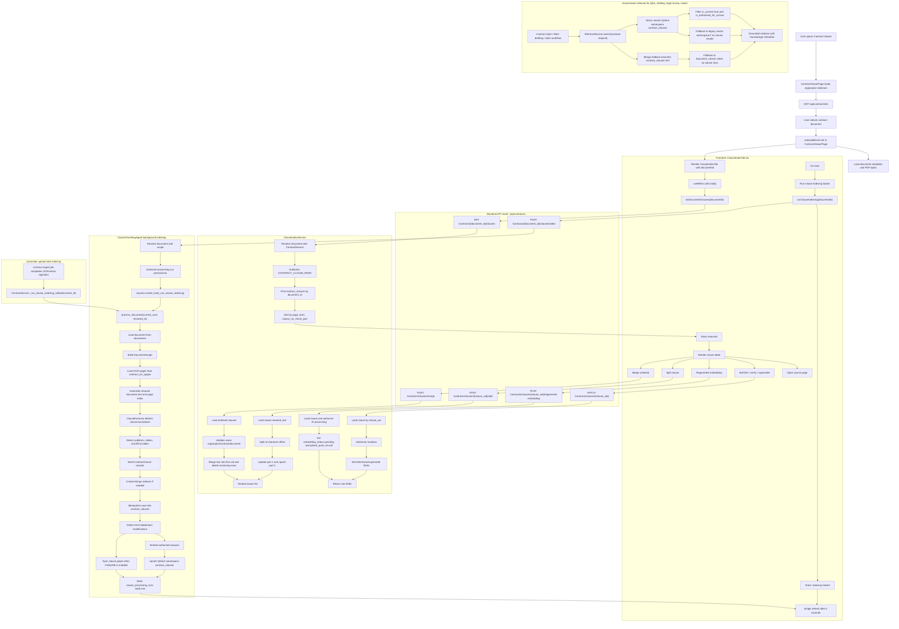

# Clause Index Tab Wiring Audit and Flow

Date: 2026-07-04

Scope: Audit how `client/src/components/contracts/ClauseIndexTab.tsx` is wired to the backend, how clause records are saved and embedded, and how those records feed later retrieval workflows.

## Source Map

- UI tab: `client/src/components/contracts/ClauseIndexTab.tsx`
- Parent page: `client/src/pages/ContractViewerPage.tsx`
- Client API adapter: `client/src/services/contracts-api.ts`
- Backend router: `backend/rbac_backend/routers/contract_clauses.py`
- Clause UI service: `backend/rbac_backend/services/contract_clause/index_service.py`
- Chunking agent: `backend/rbac_backend/services/contract_clause/agent.py`
- Clause storage: `backend/rbac_backend/services/contract_clause/storage_service.py`
- Embedding service: `backend/rbac_backend/services/contract_clause/embedding_service.py`
- Clause model: `backend/rbac_backend/models/contract_clause.py`
- Retrieval service: `backend/rbac_backend/retrieval/service.py`
- Upload ingestion hook: `backend/rbac_backend/services/contract_service.py`

## Executive Summary

The `ClauseIndexTab` is wired as a management surface for clause records saved in MongoDB collection `contract_clauses`. It can list saved clauses, trigger indexing for a selected contract document, and perform editorial operations such as title edit, verification, supersede, split, merge, and embedding regeneration.

The backend has a real clause-wise pipeline. The agent loads contract OCR pages, detects clauses and tables, writes deterministic scoped records, embeds authorised clauses to Qdrant namespace `contract_clauses`, optionally syncs clause graph data, and writes a `clause_processing_runs` audit record. Retrieval already prefers the structured clause index for contract requests before falling back to legacy token chunks.

The main gaps are around operational durability and UX: manual indexing is launched as an in-process background task without persisted job status, the UI only refreshes once after 5 seconds, embedding regeneration only marks a row as pending, split/merge actions can leave stale vector/graph data unless a later worker cleans them up, and the tab does not expose clause text even though split requires a character offset.

## Frontend Wiring

`ContractViewerPage` owns document selection. It loads organizations, projects, and contract uploads; the selected document id is stored in `selectedDocId`. The Clause Index tab is rendered as:

```tsx
<ClauseIndexTab documentId={selectedDocId} onOpenPage={openSourcePage} />
```

The `onOpenPage` callback sets the PDF page anchor and switches back to the document preview tab.

Inside `ClauseIndexTab`:

- `load()` calls `listDocumentClauses(documentId)` on mount and whenever `documentId` changes.
- If no rows exist, the empty state offers `Run clause indexing`.
- `onRunIndexing()` calls `runClauseIndexing(documentId)`, shows a toast, and calls `load()` once after 5 seconds.
- Row actions call:
  - `updateClause()` for title edit, verification, and supersede/restore.
  - `regenerateClauseEmbedding()` for embedding refresh.
  - `splitClause()` with a raw character offset.
  - `mergeClauses()` with selected clause ids.
- The table displays metadata only: clause number, title, type, page range, confidence, lifecycle status, embedding status, review status, and action buttons.

## Client API Adapter

The frontend adapter maps directly to backend API paths:

| Function | HTTP call | Purpose |
| --- | --- | --- |
| `listDocumentClauses(documentId)` | `GET /contracts/{documentId}/clauses` | List clause rows for the tab. |
| `runClauseIndexing(documentId)` | `POST /contracts/{documentId}/clauses/index` | Start clause-wise indexing. |
| `updateClause(clauseUid, patch)` | `PATCH /contracts/clauses/{clauseUid}` | Edit title, mark verified, or mark superseded. |
| `regenerateClauseEmbedding(clauseUid)` | `POST /contracts/clauses/{clauseUid}/regenerate-embedding` | Mark embedding as pending. |
| `splitClause(clauseUid, splitAt)` | `POST /contracts/clauses/{clauseUid}/split` | Split one clause by character offset. |
| `mergeClauses(clauseUids)` | `POST /contracts/clauses/merge` | Merge selected clauses into the first uid supplied. |

The base `/api` prefix is applied in the Axios/client configuration and backend router registration.

## Backend Route Wiring

The contract clause router is registered in `backend/rbac_backend/main.py` with prefix `/api`, so the browser-visible routes are under `/api/contracts/...`.

| Route | Handler | Backend behavior |
| --- | --- | --- |
| `POST /api/contracts/{document_id}/clauses/index` | `run_clause_indexing()` | Resolves the contract document, checks processing permissions and scope, then starts `_run_clause_indexing()` with `asyncio.create_task`. Returns HTTP 202. |
| `GET /api/contracts/{document_id}/clauses` | `list_document_clauses()` | Resolves the contract document, authorizes read access, and returns rows from `contract_clauses`. |
| `PATCH /api/contracts/clauses/{clause_uid}` | `update_clause()` | Loads the clause by uid, authorizes mutation, updates editorial fields, and marks `manually_edited`. |
| `POST /api/contracts/clauses/{clause_uid}/regenerate-embedding` | `regenerate_clause_embedding()` | Loads the clause, authorizes AI processing, sets `embedding_status` to `pending`, and clears `qdrant_point_id`. |
| `POST /api/contracts/clauses/{clause_uid}/split` | `split_clause()` | Splits `cleaned_text` into two `clause_part` records and marks both pending for embedding. |
| `POST /api/contracts/clauses/merge` | `merge_clauses()` | Validates all clauses are in the same document scope, merges text into the first clause, deletes the rest, and marks the survivor pending for embedding. |

## Saved Data

The primary record is `ContractClause` in MongoDB collection `contract_clauses`.

Important fields:

- Scope: `org_id`, `project_id`, `contract_id`, `document_id`
- Document context: `document_title`, `document_type`, `volume`, `revision`
- Clause identity: `clause_uid`, `clause_no`, `clause_title`, `parent_clause_no`, `clause_path`, `level`
- Text: `text` for original wording, `cleaned_text` for embedding/retrieval
- Source grounding: `page_start`, `page_end`, `char_start`, `char_end`, source file path/url
- Chunking: `chunk_type`, `chunk_index`, `chunk_part`, `chunk_total`
- Tables: `linked_clause_no`, `table_title`, `table_type`, `table_columns`, `table_rows`
- Quality and lifecycle: `confidence`, `quality_status`, `is_current`, `is_superseded`, `is_authorised_for_ai`, `human_review_required`
- Editorial state: `manually_edited`, `verified_by`, `verified_at`
- Embedding state: `embedding_status`, `qdrant_point_id`
- Change detection: `checksum`, `created_at`, `updated_at`

The agent also writes `clause_processing_runs`, with run-level counts for detected clauses, sections, tables, low-confidence chunks, duplicates, modifications, review requirement, and errors.

Qdrant receives one vector per authorised clause in namespace `contract_clauses`. The vector payload includes clause id, scope ids, document id/type, clause number/title/path, page range, lifecycle flags, and AI-authorisation flag.

## Complete Flow Chart



## Audit Findings

### High Priority

1. Manual indexing is not durable.
   The tab starts indexing through `POST /clauses/index`, but the router uses an in-process `asyncio.create_task`. If the API process restarts or the worker crashes, the task can be lost. Improvement: persist a clause-indexing job and run it through the existing contract queue/background worker path. Return a `run_id` or `job_id`.

2. The UI has no real indexing status.
   The tab refreshes once after 5 seconds. Long documents may still be processing, and failures are only logged server-side. Improvement: add `GET /api/contracts/{document_id}/clauses/index/status` returning latest run, progress, error, and row count; poll until completed/failed.

3. Embedding regeneration only marks pending.
   `regenerate_embedding()` clears `qdrant_point_id` and sets `embedding_status=pending`, but it does not immediately call `ClauseEmbeddingService` or enqueue a re-embedding job. Improvement: either synchronously re-embed that clause, or enqueue a durable single-clause embedding job.

4. Split/merge can leave stale vector and graph data.
   Merge deletes clause rows but does not delete corresponding Qdrant points or graph nodes. Split changes one row and creates a second pending row, but the vector lifecycle is not completed by the endpoint. Improvement: add vector delete/deactivate for removed clause_uids, graph cleanup/sync, and immediate or queued re-embedding for affected rows.

5. Split UX is not usable enough for legal review.
   The UI asks for a character offset, but the row API does not return `text` or `cleaned_text`, so a reviewer cannot reliably choose the offset. Improvement: add a clause detail drawer/modal that loads authorised full clause text and lets the user split by cursor selection.

### Medium Priority

6. `GET /contracts/{document_id}/clauses` resolves the document but queries with the original route id.
   The indexing route resolves `_id` and uses `resolved_id`, but list returns rows for the route `document_id`. If callers pass an alternate id, upload id, or alias, rows may not match. Improvement: use `resolved_id` consistently in list and response.

7. Merge keeper is based on selected uid order.
   `mergeClauses([...selected])` relies on JavaScript `Set` insertion order. A user can accidentally merge into the wrong first clause. Improvement: sort selected rows by source order or require explicit "merge into this clause".

8. Repeated split identity can collide.
   The second split record uses `f"{clause_uid}:split:2"`. Re-splitting an already split clause or repeated manual split operations can overwrite or confuse part identity. Improvement: derive split part ids from a stable split version or create new deterministic ids based on parent uid, part number, and checksum.

9. Mutation permission is named as create.
   Edit, split, and merge use `CONTRACT_CLAUSE_CREATE`. That works only if policy treats create as broad write. Improvement: add explicit `CONTRACT_CLAUSE_UPDATE` and possibly `CONTRACT_CLAUSE_DELETE/MERGE` permissions for clearer governance.

10. Upload-side indexing runs with no actor.
   `_run_clause_indexing_safe()` passes `current_user=None`, which is acceptable for a system job, but the audit row has no user/job actor. Improvement: record `actor_type=system`, `upload_id`, and job id in `clause_processing_runs`.

### Low Priority

11. The Clause Index tab is metadata-only.
   It cannot inspect full wording, raw versus cleaned text, duplicate status, char spans, run errors, or modification links. Improvement: add a details panel and expose a safe row-detail endpoint for authorised reviewers.

12. Page navigation is page-only.
   Records store `char_start` and `char_end`, but the UI only jumps to the PDF page. Improvement: expose char spans in detail and support text highlight where the PDF/text layer allows it.

13. OCR-page dependency needs a fallback.
   `process_document()` reads `contract_ocr_pages`. If OCR pages are missing or incomplete but legacy `document_vectors` exist, the agent can produce empty or poor results. Improvement: fallback to stored extracted text chunks or trigger OCR repair before clause indexing.

14. Row count may include table chunks and section chunks.
   The tab label says "clause records", but rows can include tables and section chunks. Improvement: show separate counts for clauses, clause parts, tables, and review-needed records.

## Recommended Implementation Plan

1. Add durable job tracking:
   - `POST /api/contracts/{document_id}/clauses/index` creates a job row and returns `{status, document_id, job_id}`.
   - Existing workers execute `ClauseChunkingAgent.process_document`.
   - Latest job/run is visible through a status endpoint.

2. Update `ClauseIndexTab`:
   - Poll status after starting indexing.
   - Show progress, last run result, and errors.
   - Disable destructive actions while indexing is active for the same document.

3. Add clause detail and text-aware editing:
   - `GET /api/contracts/clauses/{clause_uid}` returns full text for authorised users.
   - Detail drawer shows original text, cleaned text, metadata, and source page.
   - Split uses selected text position rather than a manual numeric prompt.

4. Fix vector/graph lifecycle:
   - Add delete/deactivate by `clause_uid` for merged/deleted clauses.
   - Queue re-embedding for split, merge, title edit if title participates in embedding text, and manual regeneration.
   - Sync graph changes for edited, split, merged, or superseded clauses.

5. Normalize id usage:
   - Resolve the document once in each route.
   - Use the resolved Mongo document id for all clause queries and response payloads.

6. Strengthen tests:
   - Frontend tests for load, empty state, indexing polling, and row actions.
   - Router tests for all endpoints, including permission failures and resolved id behavior.
   - Service tests for split, merge, human-edit preservation, and vector cleanup hooks.
   - Integration test: upload completed contract, automatic clause indexing, Clause Index tab list, retrieval from `contract_clauses`.

## Bottom Line

The page is correctly connected to a structured clause backend and the backend is already designed for clause-level retrieval, drafting, Q&A, legal review, claim preparation, SoC, SoD, and rejoinder workflows. The implementation should be improved before heavy production use by making indexing and re-embedding durable, exposing real status in the UI, making split/merge legally reviewable, and cleaning vector/graph state whenever clause records are edited.
