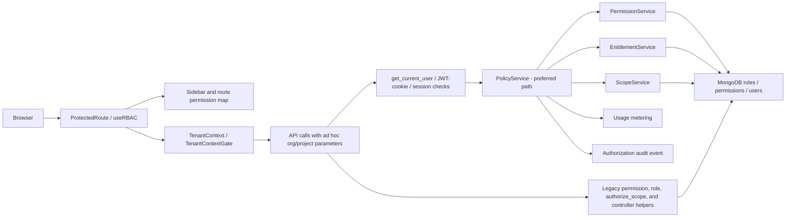

# ContraClaim RBAC, Page Access, Tenant Scope, and Subscription Entitlement Audit

**Audit date:** 3 August 2026  
**Audit type:** Comprehensive source and architecture audit; read-only  
**Repository:** `C:\SaaS\projectDMS`  
**Audited revision:** `99e93540da26427ddbc0400b2f579562e871e0aa`, plus the uncommitted working-tree state present during the audit  
**Outcome:** **Not security-accepted pending remediation and validation of the Critical and High findings**

## 1. Executive conclusion

ContraClaim has a credible modern authorization core: authenticated requests resolve the current user from signed tokens/cookies, production configuration is fail-closed, canonical permissions exist, `PolicyService` combines permission, entitlement, scope, quota, and audit decisions, `ScopeService` uses tenant memberships and expert allocations, and the React application protects the authenticated shell and filters navigation.

Those controls are not applied uniformly. The application currently has parallel authorization paths—central policy, legacy permission checks, hard-coded role checks, `authorize_scope`, controller helpers, and service-level resource checks. Several interfaces disagree about roles, permission names, tenant context, or subscription features. The most serious source-confirmed issue is the storage-settings API: it does not require a settings-management permission, treats ordinary tenant roles as sufficient, and does not prove that a requested project belongs to the supplied organisation before reading or updating a record selected by `project_id` alone. A second High issue is that active drafting workflow permissions are absent from the entitlement map and are therefore explicitly treated as “not entitlement scoped.”

The application should not be represented as having complete, consistently enforced RBAC, tenant isolation, or plan enforcement until at least the following are complete:

1. Bind storage-setting operations to a settings-management permission and to the stored project→organisation relationship.
2. Make the canonical permission catalog and the entitlement map exhaustive and test that every commercial operation is covered.
3. Bind allocation administration to the target allocation's stored tenant scope before authorization.
4. Establish one authoritative tenant-context mechanism in the client and one authoritative policy path on the server.
5. Turn the route inventory into behavioral authorization coverage rather than relying on lexical guard markers.

## 2. Audit scope and method

### 2.1 In scope

The audit covered:

- authentication, session validation, disabled-user checks, step-up authentication, and production security configuration;
- backend roles, aliases, direct and role-derived permissions, permission domains, and permission caches;
- central policy, legacy authorization services, hard-coded role checks, tenant-scope query builders, memberships, and expert allocations;
- all registered `/api` routes through the repository's route-inventory tool;
- React route registration, protected routes, role guards, sidebar filtering, page permission mappings, and tenant-context gating;
- organisation and project models, user-embedded scope, membership collections, project ownership checks, and tenant-filtered queries;
- plans, subscriptions, plan settings, add-ons, feature flags, entitlement overrides, lifecycle states, usage limits, billing, and subscription APIs;
- relevant database indexes, test coverage, and architecture documentation.

### 2.2 Graphify-first analysis

The existing Graphify knowledge graph was used before conclusions were drawn:

- `graphify-out/graph.json`: 25,492,234 bytes, generated 26 July 2026;
- `graphify-out/GRAPH_REPORT.md`: 210,453 bytes, generated 26 July 2026;
- broad query: complete active RBAC/access-control architecture, including auth, roles, routes, permissions, policy dependencies, scope, subscription, navigation, database models, and API enforcement;
- focused query: storage-settings authorization and tenant-isolation path.

The graph connected the main nodes in `core/security.py`, `core/permissions.py`, `PermissionService`, `PolicyService`, `ScopeService`, `EntitlementService`, `MonetizationService`, `AuthorizationService`, `rbac_monetization.py`, `routes.tsx`, `rolePermissions.ts`, `useRBAC.ts`, `TenantContext.tsx`, and the sidebar and subscription pages.

The graph predates the current working tree, so it was used as the application map, not as sole evidence. Every finding below was verified against current source. No Graphify rebuild or generated-artifact change was performed.

### 2.3 Quantitative coverage

- Backend route inventory: **578** `/api` routes, including **333** unsafe-method routes.
- React route file: **89** `<Route>` elements and **127** path declarations, including nested paths.
- Focused backend tests: **99 passed**.
- Focused frontend route/tenant tests: **59 passed** across four files.
- Source/configuration/package/database records were not modified.

The backend inventory is lexical. Its classification counts are useful as migration and assurance indicators, but helper-enforced routes can appear as `auth_only`. For example, item routes in `tasks.py` and `variations.py` are reported as auth-only while their `_load_authorized`/`_load` helpers call `PolicyService.authorize_document`. The counts must therefore not be interpreted as 317 confirmed vulnerabilities.

## 3. Architecture map

The preferred path is deny-by-default and composes all decision inputs. The legacy branch does not consistently apply entitlements, current membership resolution, target-resource ownership, or the same role aliases.

## 4. Severity model and finding summary

| Severity | Meaning |
|---|---|
| Critical | Credible cross-tenant or broad privilege impact with a practical source-level path. |
| High | Material authorization, entitlement, or target-scope bypass, or a systemic control gap affecting sensitive operations. |
| Medium | Inconsistent enforcement, information exposure, misleading access, or a weakness requiring additional conditions. |
| Low | Defense-in-depth, maintainability, or assurance weakness with limited direct impact. |

| ID | Severity | Finding |
|---|---:|---|
| C-01 | Critical | Storage-setting APIs lack permission enforcement and fail to bind project IDs to organisations. |
| H-02 | High | Active drafting workflow/final permissions are omitted from subscription entitlement scope. |
| H-03 | High | Expert-allocation list/update authorization is not bound to the target allocation's stored scope. |
| H-04 | High | The application has no complete machine-verifiable guarantee that every sensitive route reaches central policy. |
| M-05 | Medium | Paid/module pages use any-of permissions that allow a document viewer to enter the module shell. |
| M-06 | Medium | Client tenant state can split between `TenantContext` and page-local `localStorage` state. |
| M-07 | Medium | `/permissions/check` is an authenticated cross-user permission oracle. |
| M-08 | Medium | Frontend and backend role aliases disagree on `admin`/`administrator`. |
| M-09 | Medium | Permission sources and namespaces disagree between frontend-effective names and backend decisions. |
| M-10 | Medium | Subscription/effective-service read paths use inconsistent permission requirements. |
| M-11 | Medium | Subscription storage has no unique active-scope invariant. |
| M-12 | Medium | Settings page access, storage authorization, and SMTP authorization use incompatible models. |
| L-13 | Low | Storage Providers UI is local demo state presented as configuration. |
| L-14 | Low | Alias routes duplicate step-up checks and expand the authorization surface. |
| L-15 | Low | Current tests prove guard markers and selected behaviors, not exhaustive deny/allow matrices. |

## 5. Detailed findings

### C-01 — Storage settings can cross tenant boundaries and bypass settings permissions

**Evidence**

- `backend/rbac_backend/routers/storage_settings.py:41-48` defines `_ensure_role`, but it checks only `superadmin` or `authorize_scope`; it never checks `settings:view`, `settings:edit`, or another storage-management permission.
- Read/write routes at lines 51-77 and 102-146 use that helper. PUT routes add step-up authentication, but step-up proves recent identity; it does not grant the missing authorization permission.
- `backend/rbac_backend/core/security.py:445-454` allows `orgadmin` and `orguser` for any supplied project when their embedded project list is empty. It does not query the project to verify its organisation.
- `backend/rbac_backend/services/storage_settings_service.py:57-82` reads and upserts project storage settings using `{type: "project", project_id}` only. `org_id` is neither part of the lookup nor the update selector.
- `resolve_settings` loads organisation settings by one ID and project settings by another ID, with no ownership check (`storage_settings_service.py:122-168`).
- `ProjectStorageSettings` stores provider selection and base paths. Its model explicitly states that credentials come from environment variables (`models/storage_settings.py:14-15`), so this finding is about configuration disclosure/tampering and storage routing, not direct exposure of cloud secrets from this document.

**Impact**

- Any classic org/project user who can satisfy `authorize_scope` can call storage APIs even without a settings permission.
- An organisation-level role with no explicit project list can request another tenant's project ID while supplying or omitting an organisation ID. The service can return that project's setting or combine it with the caller's organisation setting.
- A step-up-authenticated caller can update a record selected by the arbitrary project ID and write the caller-supplied organisation ID into it. This can change provider selection, inheritance, or base paths and can affect where later file operations resolve storage.
- UI hiding does not mitigate direct API calls.

**Recommended change**

Require a canonical storage/settings read permission for GET and a management permission plus step-up for PUT. Load the project first; authorize against its stored `organization_id`; reject a caller-supplied organisation that does not match; and query/update storage settings by both project and organisation (preferably with a unique compound index). Add negative tests for org-user, settings-manager, wrong-org project ID, omitted org ID, alias routes, and project IDs stored as both strings and ObjectIds.

### H-02 — Drafting workflow permissions bypass subscription entitlements

**Evidence**

- The canonical catalog contains `drafting.final.approve` and `drafting.workflow.state|resume|cancel|checkpoints|force_v2` (`core/permissions.py:115-122`).
- `DRAFTING_FEATURE_PERMISSIONS` maps drafting request, draft, review, final-view, audit, and admin permissions, but omits all six permissions above (`services/entitlement_service.py:124-138`).
- `check_permission_entitlement` returns `True, "not_entitlement_scoped"` for any permission absent from its service-scoped sets (`entitlement_service.py:396-410`).
- Active source uses these permissions: final-state approval is mapped to `drafting.final.approve` (`services/letter_drafting/service.py:2106`); checkpoint access calls `PolicyService.authorize` with `drafting.workflow.checkpoints` (`routers/letter_drafting.py:268-281`); and force-v2 authorization uses `drafting.workflow.force_v2` (`services/letter_drafting/langgraph_engine.py:412-423`).

**Impact**

A user who has the permission and passes drafting scope/allocation checks can perform the mapped action even when the tenant has no active drafting subscription or the corresponding drafting feature is disabled. For checkpoint and force-v2 operations, step-up still applies, but plan enforcement does not.

**Recommended change**

Make entitlement coverage derived from the canonical drafting permission catalog, with explicit feature mapping for every commercial permission. Fail closed when a DMS/drafting permission lacks a mapping. Add a test that the canonical DMS/drafting set equals the entitlement-scoped set and behavior tests for no subscription, inactive, archive, offboarding, base drafting disabled, and subfeature disabled.

### H-03 — Expert-allocation administration is not target-bound

**Evidence**

- `GET /expert-allocations` accepts optional organisation/project filters. When both are omitted, policy is called without a tenant target and the service lists with no tenant filter (`routers/rbac_monetization.py:199-224`).
- `PUT /expert-allocations/{allocation_id}` authorizes `drafting.request.assign` using only the allocation ID as a resource ID; it does not first load the allocation and provide its organisation/project to policy (`rbac_monetization.py:245-255`).
- `PolicyService` permits drafting-admin permissions through either `drafting.admin` or an active expert allocation; when no scope is supplied, `ScopeService.has_expert_allocation` can be satisfied by a different active allocation (`policy_service.py:152-179`).
- `AllocationService.update_allocation` then loads and updates the target solely by allocation ID (`services/allocation_service.py:87-99`).

**Impact**

The default ContraClaim drafting manager is intentionally global, but a custom or expert account that has assignment permission through one allocation may be able to list broader allocations or modify another allocation because authorization is not tied to the target row's stored scope. Exploitability depends on the assigned permission data, so this is conditional but material.

**Recommended change**

Load the target allocation first, authorize using its stored organisation/project/package/letter/request scope, and then update with a selector that includes the authorized scope. Require explicit filters for non-global list calls and build those filters from `ScopeService`, not only from caller input.

### H-04 — Central-policy coverage is not exhaustively provable

**Evidence**

The repository inventory reports:

| Classification | Total | Unsafe |
|---|---:|---:|
| `auth_only` | 317 | 186 |
| `legacy_permission_only` | 4 | 2 |
| `permission_only` | 36 | 20 |
| `policy_service` | 135 | 61 |
| `policy_service_with_step_up` | 20 | 19 |
| `scope_only` | 9 | 6 |
| `step_up_only` | 24 | 23 |
| `system_admin_guard` | 21 | 10 |
| other/public/service-token | 12 | 6 |

The canonical authorization document says scoped/mutating endpoints should use `PolicyService`, while `AuthorizationService` describes its legacy query builders as permissive and safe only when another policy/scope layer is applied. The inventory tests validate the presence of recognized source markers, not the semantic result after helpers, service calls, target loads, or entitlement checks.

The storage defect demonstrates the assurance problem: routes are classified as auth-only/step-up-only, their helper includes a scope marker that the lexical inventory misses, yet the helper still omits permission and project ownership checks.

**Impact**

Passing route-inventory tests cannot support a claim that all sensitive operations enforce permission + entitlement + tenant scope + target ownership. Newly added helpers can silently create weaker policy paths.

**Recommended change**

Create a route-control manifest generated from the live FastAPI app. For every non-public route, declare authentication mode, permission, entitlement feature, scope source, target-load requirement, step-up requirement, and audit requirement. Add behavioral allow/deny tests for representative roles and wrong-tenant targets, and fail CI when a route lacks a complete declaration.

### M-05 — Document permission opens commercial module pages

**Evidence**

- Route alternatives are evaluated with `.some(...)`, i.e. logical OR (`client/src/config/rolePermissions.ts:391-398`).
- Appraisal, timeline, chronology, arbitration, claims/SLA, key dates, variations, bank guarantees, insurance, IPC, contract master, and tasks include `dms.document.view` as one of the alternatives (`rolePermissions.ts:283-301, 308, 326-329`).
- The sidebar uses the same route decision (`components/layout/Sidebar.tsx:274`), so a document viewer sees the links.
- Client route access does not evaluate subscription features. The server's `PolicyService` usually blocks protected API operations, but the user can enter and render each page shell before those calls fail.

**Impact**

Users without module permission—and users on plans without the module—can see module navigation and pages. Depending on what a page embeds before protected API responses, this can disclose labels, workflow structure, stale client data, or plan capability and produces inconsistent access-denied behavior.

**Recommended change**

Represent route requirements as structured all/any conditions. Require the module view permission for the module page, use document view only for embedded document actions, and add subscription feature visibility as UX guidance. Keep the server authoritative.

### M-06 — Tenant context can split between shared and page-local state

**Evidence**

- `TenantContext.tsx` owns `org_id`/`proj_id`, validates selections against accessible organisations/projects, persists them, and dispatches `tenant-context-changed` (`client/src/contexts/TenantContext.tsx:75-100`).
- No production listener for `tenant-context-changed` exists.
- Multiple pages/components independently read or write the same keys, including organisation/project storage settings, SMTP settings, Contract Master, Contract QA, contracts, search, upload, viewer, email groups, letter workflow, reports, and retrieval.
- The common API client does not inject a single authoritative tenant context; individual services/pages pass scope parameters.

**Impact**

The shared scope bar can display one context while a page holds another in component state. A page can write `localStorage` without updating the provider. This is primarily an integrity and operator-error risk because the server must still enforce scope, but it complicates incident evidence and can route an otherwise authorized action to the wrong accessible project.

**Recommended change**

Make `TenantContext` the only writer and expose typed selection/actions. Remove direct tenant-key access from pages. Inject selected scope centrally or require an explicit immutable scope object per request. Add tests that the visible scope, request parameters, and resource target remain identical through context changes.

### M-07 — Permission-check endpoint is a cross-user oracle

**Evidence**

`POST /permissions/check` accepts an arbitrary `user_id` and arbitrary permission name from any authenticated user, calls `PermissionService.user_has_permission`, and returns the result. It has no permission or tenant-scope requirement (`backend/rbac_backend/routers/permissions.py:33-50`).

**Impact**

An authenticated user who knows or discovers another user ID can enumerate that user's capabilities, including across tenants. The response is boolean, so impact is limited to authorization metadata, but it assists account targeting and tenant reconnaissance.

**Recommended change**

Default strictly to self. Permit cross-user checks only to scoped role/permission administrators, authorize the target user's stored organisation/project scope, restrict permission names to the canonical catalog, rate-limit, and audit cross-user checks.

### M-08 — `admin` and `administrator` mean superadmin only in the client

**Evidence**

The frontend aliases `admin` and `administrator` to `superadmin` (`client/src/config/rolePermissions.ts:48-56`). The backend role normalization and permission service do not give those two names the same superadmin meaning. Frontend wildcard behavior can therefore treat a legacy/custom role as globally privileged while properly guarded backend calls deny it.

**Impact**

Navigation and pages can be exposed under a false superadmin identity. If any API endpoint relies only on authentication, weak role checks, or caller scope, the UI mismatch can combine with that weaker path. Otherwise the immediate effect is misleading access and repeated server denials.

**Recommended change**

Define aliases once on the server, return normalized roles to the client, and prohibit ambiguous aliases from mapping to superadmin unless explicitly migrated and audited.

### M-09 — Effective permission sources and namespaces are inconsistent

**Evidence**

- The canonical catalog has 132 permissions. The seeded permission catalog has 191 entries, including 59 legacy names. The `Permissions` class has three platform permissions outside the canonical catalog. The frontend route map includes stale `tasks:read` while the canonical task family is `dms.task.*`.
- `/users/me` uses `get_effective_permission_names`, which includes direct `user.permissions` plus role permissions (`permission_service.py:540-609`).
- `user_has_permission`, used for backend enforcement, resolves role-derived permissions through `get_user_permissions`; it does not merge the direct `user.permissions` field into the same decision (`permission_service.py:703-813`).
- Frontend comments still describe `dms.task.*` as planned even though the backend catalog and task policy already use it (`rolePermissions.ts:326-329`).

**Impact**

A direct user permission can show a page while the backend denies the operation. Stale/legacy names increase the chance of incorrect custom roles, ineffective grants, or controls that work only because of broad aliases.

**Recommended change**

Choose one effective-permission computation for UI and server decisions. Either remove direct user grants or include them consistently with explicit governance. Generate frontend permission constants and entitlement mappings from the canonical backend catalog, and time-bound legacy aliases.

### M-10 — Subscription read controls are inconsistent

**Evidence**

- `GET /subscriptions` returns all subscription rows in the caller's allowed organisation/project scope without requiring `subscription.usage.view` or a billing permission (`routers/rbac_monetization.py:459-486`).
- `GET /subscriptions/{id}` does require `subscription.usage.view` through `PolicyService` after loading the target (`rbac_monetization.py:489-507`).
- `GET /plan-settings/effective-services` returns all effective service settings to any non-superadmin for whom `has_permission(subscription.entitlement.manage)` is true (`rbac_monetization.py:315-325`), bypassing the normal `PolicyService` domain/scope decision. Default billing admins may intentionally be global, but a custom organisation-scoped role with that permission would receive global settings.

**Impact**

Subscription metadata exposure depends on business policy and returned fields. The inconsistency makes least-privilege behavior difficult to reason about and creates a conditional cross-tenant plan-settings disclosure.

**Recommended change**

Declare who may read tenant subscription details. Apply the same permission to list and item endpoints, then scope results. Reserve global effective settings for a platform/global billing role validated through central policy; otherwise filter before returning.

### M-11 — No unique active subscription invariant

**Evidence**

- The subscription index on `(organization_id, project_id, package_id, status)` is not unique (`core/database.py:764-768`).
- Entitlement resolution asks MongoDB for one matching org/project/package subscription and sorts by project ID and `updated_at` (`entitlement_service.py:262-278`). Status is evaluated only after a row is chosen.

**Impact**

Overlapping rows can make entitlement outcomes depend on update ordering. A newer inactive project row can override an active organisation row; that may be intended project precedence, but the database does not enforce that only one current row per exact scope/lifecycle is authoritative.

**Recommended change**

Document project-over-organisation precedence, enforce one authoritative current subscription per exact scope, and detect overlaps during writes and startup/health checks. Test deterministic behavior for multiple status combinations.

### M-12 — Settings page and settings APIs use incompatible authorization models

**Evidence**

- `/settings` requires `settings:view` in the client (`rolePermissions.ts:320`). The default `settings_manager` role has `settings:view` and `settings:edit` (`initial_data/default_roles.py:245-256`).
- `authorize_scope` does not recognize `settings_manager`, so that role alone is denied by storage APIs.
- Conversely, org/project roles recognized by `authorize_scope` can call storage APIs without `settings:view`/`settings:edit`.
- The React Settings page renders all organisation storage, project storage, providers, notifications, organisation SMTP, project SMTP, and legal tabs to anyone who enters the page; only AI prompts are role-hidden (`pages/SettingsPage.tsx:12-98`).
- SMTP settings use hard-coded superadmin/orgadmin checks and project ownership validation, rather than `settings:*` permissions. This is safer for scope but still inconsistent with the page's permission model.

**Impact**

The intended settings manager can see the page but cannot consistently use it, while users with classic tenant roles can invoke some sensitive APIs directly. There is no coherent feature-permission boundary inside the Settings page.

**Recommended change**

Split settings into named capabilities (storage, SMTP, notification, legal, provider) with view/manage permissions; use them in page/tab visibility and server policy; and separately enforce target tenant ownership.

### L-13 — Storage Providers tab is not backed by persisted configuration

**Evidence**

`StorageProvidersSettings.tsx` seeds local component state with example local/S3/Azure/GCS/custom providers, including example paths/endpoints, and “saves” only into React state (`client/src/components/settings/StorageProvidersSettings.tsx:48-149`).

**Impact**

The tab presents controls and success notifications as though server configuration changed, but the state is lost and is unrelated to the actual org/project storage-settings API. This can mislead administrators during access and configuration reviews.

**Recommended change**

Remove or clearly label the demo tab until it is backed by an authorized API. Do not collect secrets in it without a secure server-side secret-management design.

### L-14 — Compatibility aliases duplicate sensitive paths and step-up calls

**Evidence**

Storage settings expose both `/settings/storage/...` and `/storage-settings/...`. PUT aliases invoke `require_step_up` and then call the primary handler, which invokes step-up again (`routers/storage_settings.py:80-99, 150-179`).

**Impact**

This does not weaken authorization by itself, but it doubles the route surface, complicates audit inventory, and can produce duplicate step-up validation/audit behavior.

**Recommended change**

Deprecate aliases with telemetry and a removal date. Share one internal operation after one route-specific authentication/authorization pass.

### L-15 — Tests do not close the key negative cases

**Evidence**

- The focused backend suite passed 99 tests and the focused frontend suite passed 59 tests.
- Existing route tests check inventory marker presence.
- Frontend tests affirm the current any-of route behavior, including document-view access to several modules.
- No focused storage-settings authorization test file was found, and the passing entitlement tests do not assert canonical-permission-to-feature exhaustiveness.

**Impact**

The test suite verifies intentional primitives while allowing the source-confirmed gaps above.

**Recommended change**

Add table-driven negative matrices: every role × permission × tenant relation × subscription state × HTTP method, with explicit wrong-org/wrong-project cases and target-loaded authorization.

## 6. Authentication and session controls

### Verified controls

- `get_current_user` resolves a bearer token and then the HttpOnly cookie, validates token type, checks revocation/session state, and reloads the user from MongoDB for each request.
- Disabled users are rejected by `get_current_active_user`.
- Session-store outage behavior is fail-closed by default.
- Development header authentication is disabled by default and guarded by `ALLOW_DEV_HEADERS`.
- Production validation rejects development headers, entitlement fail-open, insecure cookies, weak/missing secrets, and related insecure combinations.
- Superadmin context is sanitized to avoid accidental client-tenant attachment.
- Step-up authentication protects numerous high-risk mutations, but it must remain a second factor in the authorization decision, not a replacement for permission or scope.

### Residual concerns

- Some routes use `get_current_user` rather than `get_current_active_user`; current user loading still checks disabled state in the inspected path, but the dependency naming is inconsistent.
- Multiple authorization services and helper layers make it harder to prove that authentication is always followed by the required permission, entitlement, and target-scope checks.

## 7. Role and scope model

| Role family | Intended scope | Observed behavior |
|---|---|---|
| `superadmin` | Global platform | Wildcard permission, global scope, and central-policy entitlement bypass. This should be explicitly documented and audited. |
| `superuser` | Granted organisations/projects | `authorize_scope` denies if no allowed organisation; project restrictions apply when explicit projects exist. |
| `orgadmin`, `orguser` | One/allowed organisation, optionally all its projects | Legacy `authorize_scope` trusts the user's organisation and optional embedded project list; it does not itself load project ownership. `ScopeService` is stronger. |
| `projectadmin`, `projectuser` | Assigned project(s) | Legacy helper requires the project in the embedded list and compares supplied organisation to user organisation. |
| document/reporter/settings/limited/contract roles | Custom tenant roles | Frontend and default-role permissions exist, but legacy `authorize_scope` does not recognize most of these roles. They depend on overlapping roles or newer `ScopeService` paths. |
| ContraClaim drafting manager/experts | Global manager or active allocation | Central policy uses allocation scope; list/update administration has the target-binding gap in H-03. |
| ContraClaim billing admin | Global billing administration | Central policy allows global plan/entitlement administration. Globality should be asserted through account type/role, not inferred from one permission on read endpoints. |

`ScopeService` is the preferable implementation: it consults user fields plus active organisation/project membership collections, verifies project→organisation relationships, and evaluates active expert allocations. `authorize_scope` and `build_scope_query` are narrower hard-coded legacy helpers and can diverge from it.

## 8. Page and navigation access matrix

| Page group | Client gate | Scope gate | Entitlement visibility |
|---|---|---|---|
| Overview/profile/notifications/security terms/legal words | Open to authenticated shell or mapped basic permission | Listed as context-free where appropriate | None |
| Organisations/projects/users/permissions | Legacy organisation/project/user/role permissions | Mostly context-free administration; backend must scope target | None |
| Documents/upload/search/view/share | `dms.document.*` | TenantContextGate plus request scope | Documents page uses entitlement data for at least draft-request UI; not a universal route gate |
| Letter drafting/templates | drafting request/template permissions | TenantContextGate and server policy/allocation | Server entitlement when mapped; H-02 exceptions |
| Contract processing/master/appraisal/timeline | module permission OR document view | TenantContextGate; pages pass local scope | No sidebar/route feature gating |
| Claims/SLA/tasks/key dates/variations/BG/insurance/IPC | module permission OR document view | TenantContextGate; server endpoints vary | No sidebar/route feature gating |
| Chronology/arbitration | module permission OR document view | TenantContextGate; server resource helpers/policy | No sidebar/route feature gating |
| Reports/retrieval/observability/health | report/document/system permission | Route-specific scope | No common feature gate |
| Settings | `settings:view` | Marked context-free; individual tabs select scope | No structured tab capability or plan gate |
| Plan settings/subscription/billing catalog | billing/subscription permissions or broad allowed alternatives | Context-free page; APIs scope separately | These pages display/manage the entitlement data itself |

Client guards are correctly treated in source comments as UX controls. They are not a security boundary. Unmapped routes default closed in the route descriptor, which is a positive control.

## 9. Subscription-plan entitlement model

### Effective model

1. Resolve an exact project/package subscription before an organisation-level subscription.
2. Merge feature values in this order: code fallback → plan document → active add-ons → subscription overrides.
3. Enforce lifecycle:
   - active/trial/pilot: normal feature checks;
   - archive/read-only: block writes/admin, allow reads;
   - offboarding: permit only export/download paths;
   - other/inactive: deny.
4. Require base DMS or base drafting plus any mapped module subfeature.
5. Enforce configured usage quotas through metering where the route supplies a metered event.
6. Fail closed when no subscription records exist unless the explicit development fail-open flag is enabled; production config rejects that flag.

### Positive controls

- DMS commercial modules have explicit feature keys for claims, appraisal, tasks, key dates, variations, bank guarantees, insurance, contract master/processing, IPC, evidence graph, timeline, chronology, and arbitration.
- Subscription mutations generally load the target subscription, authorize its stored scope, require step-up for sensitive lifecycle changes, and emit history/audit records.
- Billing webhooks verify signatures and use a pending-to-active lifecycle.

### Exceptions requiring action

- H-02: active drafting workflow permissions fall outside the feature map.
- Routes that use only legacy permission/scope helpers do not receive entitlement checks at all.
- Superadmin bypasses entitlements at the start of `PolicyService.authorize`; this appears intentional but should be a documented, monitored platform break-glass rule.
- The UI does not consistently hide or annotate unavailable plan modules.

## 10. Data and database control observations

Relevant collections/indexes include users, roles, permissions, role assignments, organisation memberships, project memberships, expert allocations, plans, subscriptions, entitlements, usage events/periods, quota buckets, billing records/webhook events, offboarding exports, and authorization audit events.

Positive observations:

- Membership and expert-allocation compound indexes support scope lookups.
- Plans have a unique code.
- Billing webhook events have a unique event ID.
- Many domain collections have organisation/project compound indexes.

Gaps:

- Subscription scope/status index is not unique (M-11).
- No startup index for storage settings was identified in the inspected database initialization, despite project lookups depending on project ID uniqueness.
- User-embedded organisation/project assignments coexist with membership collections; legacy helpers read the former while `ScopeService` can read both, creating two sources of truth.

## 11. Test and verification record

### Commands and outcomes

- Graphify broad architecture query: completed; 2,134 nodes in BFS depth 2.
- Graphify focused storage-scope query: completed; 998 nodes in BFS depth 2.
- Backend route inventory: completed; 578 routes and the classifications recorded above.
- Backend focused tests:
  - `test_rbac_policy_hardening.py`
  - `test_rbac_monetization.py`
  - `test_route_inventory.py`
  - `test_permission_catalog.py`
  - `test_role_alias_resolution.py`
  - `test_tenant_isolation.py`
  - Result: **99 passed**; only pre-existing deprecation warnings.
- Frontend focused tests:
  - route inventory;
  - role/sidebar permissions;
  - tenant context;
  - tenant-context gate.
  - Result: **59 passed in 4 files**.

### What was not done

- No source, migration, configuration, dependency, database, branch, remote, or production changes.
- No live database inspection, user impersonation, exploit attempt, network scan, or production browser/API testing.
- No claim that current production data contains overlapping subscriptions or malicious role grants.
- No automatic remediation.

## 12. Recommended remediation order

These are recommendations only; none were implemented.

### Immediate

1. Disable or tightly restrict storage-settings read/write endpoints until C-01 is fixed and regression-tested.
2. Add all active drafting workflow/final permissions to entitlement enforcement and fail closed on unmapped commercial permissions.
3. Bind expert-allocation list/update to stored target scope.

### Near term

4. Define a route-control manifest and behavioral wrong-tenant matrix.
5. Replace page module OR gates with structured permission requirements and plan-aware visibility.
6. Remove page-local tenant key mutation and make `TenantContext` authoritative.
7. Restrict the cross-user permission-check endpoint.
8. Align backend/frontend role aliases and permission catalogs.

### Hardening

9. Consolidate legacy `AuthorizationService`, `authorize_scope`, role-name checks, and controller helpers behind `PolicyService`/`ScopeService`.
10. Enforce subscription and storage-setting uniqueness/ownership invariants in data access and indexes.
11. Split Settings into explicit feature permissions and remove the local demo provider configuration.
12. Add continuous tests that every canonical commercial permission is mapped to an entitlement feature and every unsafe route has semantic policy coverage.

## 13. Acceptance criteria for a follow-up audit

A follow-up audit should require evidence that:

- wrong-organisation and wrong-project storage reads/writes return 403 and cannot change a target record;
- settings manager, org admin/user, and project admin/user allow/deny behavior matches an approved matrix;
- every canonical DMS/drafting permission is either entitlement-mapped or explicitly declared non-commercial with a reviewed rationale;
- inactive/archive/offboarding/no-subscription tests cover final approval, workflow checkpoint, fallback, resume/cancel/state, and all module mutations;
- allocation list/item/update authorization uses the target row's stored scope;
- no client page writes `org_id` or `proj_id` outside `TenantContext`/authentication cleanup;
- module routes and sidebar items require the correct module permission and accurately represent plan availability;
- all unsafe API routes have behaviorally tested permission, entitlement, scope, target ownership, step-up, and audit declarations;
- frontend and backend consume one role/permission alias contract;
- focused negative tests and the full CI workflow are green.

## 14. Final audit opinion

The central design is directionally strong, and many sensitive domain endpoints already use target-loaded `PolicyService` checks. However, control effectiveness is defined by the weakest active path. The storage-setting path provides a source-confirmed combination of missing feature permission, incomplete tenant binding, and a project-only database selector. Drafting entitlements also have an explicit fail-open classification for active workflow permissions. Together with target-unbound allocation administration and fragmented policy coverage, these issues prevent a conclusion that ContraClaim currently enforces RBAC, organisation/project isolation, and subscription entitlements comprehensively.

**Final status: remediation required; no implementation or production-acceptance claim is supported by this audit.**
