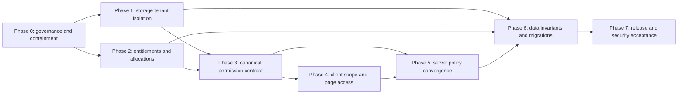

# ContraClaim RBAC, Tenant Scope, and Subscription Entitlement Resolution Plan

**Plan date:** 4 August 2026  
**Source audit:** [CONTRACLAIM_RBAC_SCOPE_ENTITLEMENT_AUDIT_2026-08-03.md](./CONTRACLAIM_RBAC_SCOPE_ENTITLEMENT_AUDIT_2026-08-03.md)  
**Plan type:** Phased remediation plan; no implementation performed  
**Starting audit status:** Not security-accepted  
**Target status:** Security-accepted after all mandatory phase gates and independent re-audit evidence pass

## 1. Purpose

This plan converts every finding in the 3 August 2026 audit into an ordered resolution programme. It defines:

- the issue being resolved;
- the required technical and governance resolution;
- the affected control boundaries and likely source areas;
- the tests and evidence required before the phase can close;
- dependencies, rollback considerations, and acceptance gates.

This document does not authorize implementation, migrations, configuration changes, database writes, commits, deployment, or production rollout. Each phase requires separate approval before execution.

## 2. Resolution principles

The programme must follow these principles throughout:

1. **The server is authoritative.** Client route and navigation controls improve user experience but never replace API authorization.
2. **Authorize the stored target.** Load the target resource first, derive its organisation/project/package scope from stored data, then authorize the requested action.
3. **Permission, entitlement, scope, and lifecycle are separate checks.** Passing one must never imply the others.
4. **Default deny.** Unknown permissions, unmapped commercial permissions, unsupported roles, missing scope, and ambiguous subscription data must fail closed.
5. **One source of truth per concept.** Roles, aliases, effective permissions, tenant context, and subscription precedence must each have one authoritative definition.
6. **No silent compatibility bypass.** Legacy names and routes may be temporarily supported only through explicit adapters, telemetry, expiry dates, and identical authorization.
7. **Evidence before acceptance.** Unit tests alone are insufficient; wrong-tenant HTTP tests, migration evidence, audit events, browser checks, and production readiness evidence are required.
8. **Preserve recoverability.** Any later database or production phase must be backup-first, reversible, scoped, and verified before destructive cleanup.

## 3. Finding-to-phase map

| Finding | Severity | Primary phase | Resolution outcome |
|---|---:|---:|---|
| C-01 Storage settings permission and tenant-binding failure | Critical | Phase 1 | Every read/write is permission-gated and bound to the stored project→organisation relationship. |
| H-02 Drafting workflow entitlement omissions | High | Phase 2 | Every commercial drafting permission is exhaustively entitlement-mapped and fail-closed. |
| H-03 Expert allocation is not target-bound | High | Phase 2 | Allocation list/item/update decisions use the target allocation's stored scope. |
| H-04 Central-policy coverage is not provable | High | Phase 5 | Every non-public route has a declared and behaviorally tested control contract. |
| M-05 Document viewers can enter paid module pages | Medium | Phase 4 | Module pages require the module permission; plan availability is accurately shown. |
| M-06 Shared and page-local tenant state can diverge | Medium | Phase 4 | `TenantContext` becomes the only production tenant-state authority. |
| M-07 Cross-user permission oracle | Medium | Phase 3 | Self-check is default; cross-user checks are permissioned, scoped, restricted, audited, and rate-limited. |
| M-08 Client-only superadmin aliases | Medium | Phase 3 | Server-issued normalized roles are the sole alias authority. |
| M-09 Permission source and namespace inconsistency | Medium | Phase 3 | UI and backend use one effective-permission resolver and generated canonical contract. |
| M-10 Inconsistent subscription read controls | Medium | Phase 2 | List, detail, and effective-service reads use an approved, consistent scope/permission policy. |
| M-11 No unique active subscription invariant | Medium | Phase 6 | Data is reconciled and one authoritative current subscription per exact scope is enforced. |
| M-12 Settings page/API authorization mismatch | Medium | Phases 1, 3, 4 | Settings capabilities are explicit and consistent in UI and API policy. |
| L-13 Local demo storage-provider UI | Low | Phase 4 | Demo state is removed or unmistakably labeled until securely implemented. |
| L-14 Duplicate compatibility routes/step-up | Low | Phases 1, 5 | Aliases share the same internal policy path, emit telemetry, and are retired safely. |
| L-15 Incomplete negative authorization tests | Low | All phases, finalised in Phase 5 | A route/role/scope/subscription negative matrix is enforced in CI. |

## 4. Phase overview and dependencies

| Phase | Objective | Findings | Relative effort | Mandatory before production acceptance |
|---:|---|---|---:|---:|
| 0 | Approve policy, baseline evidence, and contain immediate exposure | All, with C-01 priority | Small | Yes |
| 1 | Fix storage settings permission and tenant isolation | C-01, M-12, L-14 | Medium | Yes |
| 2 | Close commercial entitlement and target-allocation gaps | H-02, H-03, M-10 | Medium | Yes |
| 3 | Establish one canonical role/permission/settings contract | M-07, M-08, M-09, M-12 | Large | Yes |
| 4 | Align client page access, plan visibility, and tenant context | M-05, M-06, M-12, L-13 | Large | Yes |
| 5 | Prove and converge server-wide authorization coverage | H-04, L-14, L-15 | Large | Yes |
| 6 | Reconcile data and enforce database invariants | M-11 and storage invariants | Medium | Yes where schema changes are approved |
| 7 | Full verification, controlled rollout, and independent acceptance | All | Large | Yes |

Relative effort is intentionally expressed as Small/Medium/Large rather than calendar dates. Duration depends on approved policy decisions, data condition, and the number of route exceptions found in Phase 5.

## 5. Phase 0 — Governance, baseline, and immediate containment

### Objective

Prevent further exposure while converting implicit behavior into an approved security contract. No permanent implementation should begin until the required role, scope, and subscription decisions are recorded.

### Issues addressed

- C-01 is immediately exploitable at source level and should not wait for the wider refactor.
- M-10, M-12, and the global superadmin/billing/drafting roles depend on undocumented business-policy decisions.
- H-04 prevents a reliable estimate of all authorization migration work.

### Resolution work

1. Approve an emergency restriction for storage-settings GET/PUT paths. Preferred containment is an explicit superadmin or narrowly defined storage-admin permission until Phase 1 passes. Do not rely on UI hiding.
2. Create and approve an access-control decision record covering:
   - canonical roles and whether direct user permission grants remain supported;
   - organisation roles that may act across all projects in their organisation;
   - whether settings managers may manage storage, SMTP, notifications, legal settings, and providers;
   - whether ContraClaim drafting and billing administrators are global by role/account type;
   - whether superadmin entitlement bypass is a normal platform capability or controlled break-glass action;
   - who may read subscription lists, details, usage, and global effective-service settings;
   - project-over-organisation subscription precedence and lifecycle behavior.
3. Capture a reproducible baseline:
   - audited commit and dirty-worktree diff;
   - live FastAPI route inventory;
   - canonical, seeded, frontend, and entitlement permission sets;
   - current focused and full test results;
   - production route/configuration version only if production inspection is separately authorized.
4. Define the security test personas and tenant fixtures used through all phases:
   - superadmin, constrained superuser;
   - org admin/user/settings manager;
   - project admin/user/document controller/reporter/limited user;
   - drafting manager/expert drafter/expert reviewer;
   - billing admin;
   - users with no scope, wrong organisation, wrong project, disabled membership, expired allocation, inactive subscription, archive, and offboarding states.
5. Define audit-event requirements for every allow/deny decision involving settings, roles, allocation, subscription lifecycle, or cross-user inspection.

### Deliverables

- Approved RBAC/scope/entitlement decision record.
- Emergency containment evidence for storage-settings routes.
- Baseline route and permission inventories.
- Approved test persona and tenant matrix.
- Phase-specific owners: backend security, frontend, database, QA/security validation, and release operations.

### Exit gate

- Direct API requests by ordinary org/project roles cannot read or modify storage settings during the remediation window.
- All unresolved business-policy choices are recorded with an owner and decision date.
- Baseline artifacts can be regenerated without changing application state.

## 6. Phase 1 — Storage settings permission and tenant isolation

### Objective

Eliminate C-01 by making storage settings a target-loaded, permission-gated, tenant-bound operation for primary and compatibility routes.

### Issue definition

Current storage routes call `_ensure_role`, which checks a limited role/scope helper rather than a storage/settings permission. Project storage records are read and updated by `project_id` alone, and the project→organisation relationship is not loaded and verified. Step-up protects recent identity but does not supply missing authorization.

### Required resolution

1. Define canonical capabilities, subject to the Phase 0 decision:
   - storage settings view;
   - storage settings manage;
   - optionally provider and path management as separate high-risk capabilities.
2. Add them to the canonical permission catalog, default-role design, seed compatibility, permission domains, frontend contract, and audit naming.
3. Replace `_ensure_role` with central policy authorization:
   - GET requires view permission;
   - PUT requires manage permission plus step-up;
   - superadmin behavior follows the approved break-glass/global policy.
4. For project operations:
   - load the project by path `project_id` before reading settings;
   - derive `organization_id` from the stored project;
   - reject a supplied organisation that differs;
   - authorize against the stored organisation/project;
   - query and update settings by both organisation and project;
   - prevent the payload from changing the target scope.
5. For organisation operations, authorize the path organisation and override any conflicting payload scope.
6. Make `resolve_settings` validate the project belongs to the organisation before combining settings.
7. Route both compatibility and primary endpoints through one internal operation after exactly one authentication, authorization, step-up, and audit pass.
8. Add structured audit events containing actor, permission, stored target scope, route alias used, result, and reason, without sensitive configuration content.
9. Prepare a later compound uniqueness invariant for Phase 6; Phase 1 code must safely handle pre-existing duplicates until reconciliation is complete.

### Likely source areas

- `backend/rbac_backend/routers/storage_settings.py`
- `backend/rbac_backend/services/storage_settings_service.py`
- `backend/rbac_backend/models/storage_settings.py`
- `backend/rbac_backend/services/policy_service.py`
- `backend/rbac_backend/services/scope_service.py`
- `backend/rbac_backend/core/permissions.py`
- default permission/role seeds
- `client/src/services/storage-settings-api.ts`
- storage settings components and Settings page
- focused backend/client tests

### Required tests

| Scenario | Expected result |
|---|---|
| Unauthenticated GET/PUT | 401 |
| Authenticated user without storage permission | 403 |
| View-only user GET in own scope | 200 |
| View-only user PUT | 403 |
| Manager PUT without valid step-up | 403 |
| Manager PUT with step-up in own stored scope | Success and one audit event |
| Correct org but wrong project | 403; no record read or changed |
| Caller supplies org A with project owned by org B | 403; no mixed resolution |
| Caller omits org for a foreign project | 403 |
| Payload scope conflicts with path/stored target | 400/403; no mutation |
| String/ObjectId-compatible project identifiers | Same authorization outcome |
| Primary and alias routes | Identical result; one step-up and policy decision |
| Duplicate legacy storage rows | Deterministic fail-closed or explicit conflict; never arbitrary selection |

### Exit gate

- All wrong-tenant read/write and mixed-resolution tests pass.
- The settings-manager and org/project role behavior matches the approved Phase 0 matrix.
- No storage-setting operation uses caller scope as proof of target ownership.
- Audit logs prove both allowed and denied target-bound decisions.
- C-01 can be independently reproduced as fixed without relying on frontend controls.

## 7. Phase 2 — Subscription entitlements and expert-allocation scope

### Objective

Make commercial access exhaustive and fail-closed, and ensure allocation administration is authorized against the actual target allocation.

### H-02: entitlement resolution

**Issue:** `drafting.final.approve` and workflow state/resume/cancel/checkpoints/force-v2 are canonical permissions but absent from `DRAFTING_FEATURE_PERMISSIONS`. The entitlement service consequently returns `not_entitlement_scoped`.

**Resolution:**

1. Classify every canonical DMS/drafting permission as commercial or explicitly non-commercial.
2. Map every commercial permission to base DMS/drafting and any required subfeature.
3. Change the entitlement service so an unmapped `dms.*` or `drafting.*` permission denies by default and emits an actionable audit/diagnostic reason.
4. Derive or test the entitlement map against the canonical catalog so future additions cannot be silently omitted.
5. Apply lifecycle behavior consistently to final approval, workflow state/resume/cancel/checkpoints/fallback, and all metered operations.
6. Document the intentional global exception, if approved, for drafting assignment/admin without tenant scope; otherwise remove it.

### H-03: allocation target binding

**Issue:** Allocation list and update policy can be satisfied without the target allocation's organisation/project/package scope. An authorization derived from one allocation can therefore be applied to another target ID under certain custom grants.

**Resolution:**

1. Load the allocation before policy authorization.
2. Authorize using the allocation's stored organisation, project, package, letter, request, expert user, status, and assignment role as applicable.
3. Update using a selector that includes the authorized target scope and expected version/status.
4. Require explicit scope filters for non-global list calls and derive allowed filters from `ScopeService`.
5. Separate global allocation administration from allocation-derived expert permissions; an expert's own allocation must never grant global allocation management.
6. Add step-up and audit events to all allocation mutations, including before/after scope and permission grants.

### M-10: subscription read policy

**Issue:** Subscription list, detail, and effective-service endpoints require different permissions and use different policy paths. A custom scoped user with entitlement-management permission can receive global effective settings.

**Resolution:**

1. Adopt the approved Phase 0 read matrix.
2. Require the same approved subscription-view capability for list and item reads, followed by stored target scope filtering.
3. Reserve global plan/effective-service data for an explicitly global billing/platform identity validated by `PolicyService`, not `has_permission` alone.
4. Filter scoped effective-service responses before serialization.

### Required tests

- Set equality: canonical commercial permissions equal entitlement-mapped permissions.
- One behavior test for every subscription lifecycle: none, active, trial, pilot, inactive, archive, offboarding, cancelled/expired as supported.
- Base feature and each subfeature disabled.
- Final approval, checkpoint view, force-v2, state, resume, and cancel under every lifecycle.
- Allocation self-scope, other project, other organisation, expired/revoked allocation, and custom permission grant.
- Global drafting/billing role tests based on approved role/account type.
- Subscription list/detail/global-effective settings for each role and scope.

### Exit gate

- No canonical commercial permission can return `not_entitlement_scoped`.
- No allocation operation can authorize from a different allocation's scope.
- List and item subscription reads follow one documented policy.
- H-02, H-03, and M-10 negative tests pass with auditable denial reasons.

## 8. Phase 3 — Canonical roles, permissions, and settings capabilities

### Objective

Remove identity and permission ambiguity so frontend visibility, backend authorization, seeds, and entitlements consume one contract.

### M-08: role normalization

**Issue:** The client maps `admin` and `administrator` to superadmin while the backend does not.

**Resolution:**

1. Make the server the sole normalizer and return canonical role IDs in `/users/me`.
2. Remove privilege-elevating client aliases.
3. Inventory stored legacy aliases and migrate only after explicit mapping approval.
4. Reject unknown privileged aliases and audit attempted assignment/use.

### M-09: effective permission and namespace convergence

**Issue:** Canonical, seeded, class, legacy, frontend, entitlement, direct-user, and role-derived permission sets differ. Frontend effective permissions include direct user grants while backend decisions do not use the same computation.

**Resolution:**

1. Decide whether direct user grants remain supported.
2. Implement one effective-permission resolver used by both `/users/me` and backend authorization.
3. Define the canonical permission catalog as the generated source for:
   - backend constants and domains;
   - default permissions and role validation;
   - frontend permission constants/route descriptors;
   - entitlement coverage checks;
   - administrative permission selection UI.
4. Create a legacy-alias registry with direction, expiry, replacement, telemetry, and collision tests.
5. Replace stale `tasks:read` with the canonical task permission according to the approved route behavior.
6. Invalidate permission caches whenever roles, direct grants, aliases, memberships, or account status change; include a contract/cache version in cache keys.

### M-07: permission-check endpoint

**Issue:** Any authenticated user can test arbitrary permissions for an arbitrary user ID.

**Resolution:**

1. Make self-check the only default behavior; ignore or reject a different `user_id` without management authority.
2. For approved administrators, load the target user, authorize the stored tenant scope, restrict names to the canonical catalog, rate-limit, and audit.
3. Avoid returning role membership or resolution internals beyond the required boolean.

### M-12: explicit settings capabilities

**Issue:** The Settings page uses `settings:view`, storage uses legacy role/scope checks, and SMTP uses hard-coded roles.

**Resolution:**

Define explicit view/manage capabilities for approved settings domains, for example storage, SMTP, notification, legal, provider, and AI prompt settings. Map them to roles through policy rather than hard-coded role names, while still separately enforcing tenant ownership and step-up.

### Compatibility and rollout

- During transition, return both canonical permissions and a compatibility-version indicator only if older clients require it.
- Log legacy alias use before removal.
- Never make `admin` a temporary superadmin synonym to preserve UI behavior.
- Keep new permission decisions fail-closed when an old client sends an unknown permission.

### Exit gate

- Backend and frontend contract tests use the same canonical role and permission inventory.
- `admin`/`administrator` cannot produce superadmin UI or API behavior unless the stored canonical role is truly superadmin.
- Direct permissions behave identically in UI and backend or are rejected everywhere.
- The permission oracle is self-only by default and cross-user checks are scoped and audited.
- Every Settings tab/API has an explicit capability and target-scope rule.

## 9. Phase 4 — Client page access, tenant context, and plan visibility

### Objective

Make the client accurately represent server permissions, selected tenant scope, and subscription availability without treating client controls as security enforcement.

### M-06: one tenant-context authority

**Issue:** Multiple pages directly read/write `org_id` and `proj_id`; no production listener reconciles those writes with `TenantContext`.

**Resolution:**

1. Make `TenantContext` the only production writer of organisation/project selection.
2. Expose typed actions and an immutable request-scope object containing IDs and a context version.
3. Replace page-local storage reads/writes with context consumption.
4. Centralize request scope injection or require each scoped service call to accept the immutable scope object.
5. Validate project membership and project→organisation ownership whenever selection changes.
6. Clear project selection atomically when organisation changes or the project is no longer accessible.
7. Keep logout/authentication cleanup as the only direct key-removal exception, or route it through context reset.

### M-05: module route/page requirements

**Issue:** Route requirements use logical OR and include `dms.document.view`, allowing document viewers to see paid/module navigation and page shells.

**Resolution:**

1. Replace flat permission arrays with structured descriptors supporting `allOf`, `anyOf`, and optional action-specific conditions.
2. Require the module view permission for module routes.
3. Require document permission only for embedded document actions, not as a substitute for module access.
4. Add plan-feature state to navigation/page presentation:
   - enabled and permitted: normal link;
   - entitled but not permitted: hidden or access explanation per UX policy;
   - permitted but not entitled: upgrade/plan-unavailable presentation without loading protected data;
   - unavailable/unknown: fail closed in UI and let server remain authoritative.
5. Ensure deep links receive the same decision as sidebar links.

### M-12 and L-13: Settings page composition

1. Render each tab only when the corresponding Phase 3 capability allows it.
2. Require manage capability before enabling save/test controls.
3. Remove the local-only Storage Providers demo, or label it as non-persistent and non-operational until a secure API is separately designed.
4. Never store provider credentials in the browser or ordinary settings documents.

### Required tests

- No production component outside `TenantContext`/approved auth reset reads or writes tenant keys directly.
- Visible organisation/project labels equal the scope sent with every tested API request.
- Organisation change clears or revalidates project before any request.
- Document-only users cannot see or deep-link into module pages.
- Module permission without plan entitlement shows the approved unavailable state and makes no protected data call.
- Plan entitlement without module permission does not reveal the page.
- Settings tabs and actions follow view/manage capabilities independently.
- Sidebar, protected route, page component, and deep-link behavior use the same descriptor.

### Exit gate

- Tenant context cannot become split-brain in automated interaction tests.
- Page and navigation behavior matches the approved role × permission × plan matrix.
- No client test asserts broad document-view access as a substitute for module permission.
- The server still returns the correct denial when client controls are bypassed.

## 10. Phase 5 — Server-wide policy convergence and authorization assurance

### Objective

Make central policy coverage complete, explicit, and behaviorally provable across every registered API route.

### H-04: route-control manifest

**Issue:** The lexical inventory identifies guard markers but cannot prove semantic permission, entitlement, scope, target ownership, step-up, and audit coverage through helpers and service calls.

**Resolution:**

1. Generate a manifest from the live FastAPI application with one row per method/path.
2. Require every non-public route to declare:
   - authentication mode;
   - active-user requirement;
   - canonical permission;
   - entitlement feature or reviewed non-commercial rationale;
   - organisation/project/package scope source;
   - whether the target must be loaded before authorization;
   - step-up requirement;
   - audit event and denial reason requirements;
   - quota/metering requirement;
   - public/service-token justification and owner.
3. Fail CI for missing, ambiguous, duplicate, or stale declarations.
4. Maintain the existing lexical inventory as a change detector, not as proof of control effectiveness.

### Policy migration

1. Prioritize unsafe `auth_only`, `step_up_only`, `scope_only`, legacy-permission, and permission-only routes.
2. Inspect helper-protected item routes separately; retain good target-loaded helpers but make their policy contract visible to the manifest.
3. Move permission, entitlement, and scope decisions to `PolicyService` and `ScopeService`.
4. Retire or restrict permissive query builders in `AuthorizationService`, `authorize_scope`, and `build_scope_query` after all consumers migrate.
5. Require target-loaded authorization for item GET/PUT/PATCH/DELETE and filtered scope queries for collections.
6. Standardize status codes: 401 unauthenticated, 403 unauthorized/entitlement denied, 404 only when the approved anti-enumeration policy requires it, and 409 for data conflicts.
7. Preserve actionable internal audit reasons without leaking sensitive policy detail to clients.

### L-14: route alias retirement

1. Inventory compatibility aliases and clients using them.
2. Route aliases through identical internal operations.
3. Emit deprecation headers/telemetry where supported.
4. Remove aliases only after an approved usage-free period and client migration evidence.

### L-15: behavioral authorization matrix

Create table-driven tests covering:

- all representative roles and no-role users;
- permission present/absent and direct/role-derived grants per approved policy;
- own organisation/project, other accessible project, wrong organisation/project, and no scope;
- active/inactive membership and allocation;
- every subscription lifecycle and feature state;
- safe and unsafe methods;
- target exists/does not exist/scope mismatch;
- primary and alias routes;
- step-up present/absent/expired;
- expected audit allow/deny records.

### Exit gate

- The manifest covers 100% of registered routes and reconciles with the live application.
- Every unsafe route has a behavioral wrong-tenant denial test.
- No sensitive route depends solely on authentication, step-up, or caller-supplied scope.
- Legacy helpers have no unapproved consumers.
- Full backend and frontend tests, security checks, and root CI workflow are green.

## 11. Phase 6 — Data reconciliation and database invariants

### Objective

Enforce tenant and subscription invariants only after application code can safely detect and handle legacy data.

### Preconditions

- Phases 1, 2, 3, and 5 are complete.
- A current backup and tested restore procedure are approved.
- Read-only duplicate/orphan reports have been reviewed.
- The application fails closed on ambiguous rows before any unique index is introduced.

### M-11: subscription invariant

**Issue:** Multiple rows can represent the same organisation/project/package scope and status, while entitlement selection chooses one by precedence/update order.

**Resolution:**

1. Define the exact unique/current key and project-over-organisation precedence.
2. Produce a read-only report of duplicate, overlapping, missing-scope, invalid-status, and conflicting-lifecycle rows.
3. Approve a deterministic reconciliation rule; do not auto-delete records without review and recoverability.
4. Preserve lifecycle/history evidence separately from the one authoritative current subscription.
5. Add write-time conflict detection and a suitable unique/partial index after reconciliation.
6. Add startup/readiness diagnostics for ambiguity and index presence.

### Storage-setting invariant

1. Report duplicate project settings, project rows with wrong/missing organisation, orphan projects, and mixed ID types.
2. Reconcile each row to the project's authoritative organisation.
3. Add the approved unique compound index, aligned with the Phase 1 query selector.
4. Retain a migration audit ledger and before/after counts/checksums.

### User/membership scope sources

1. Compare user-embedded organisations/projects with active membership collections.
2. Choose the authoritative source and define a compatibility/read transition.
3. Reconcile discrepancies with an approved report; do not expand user scope automatically.
4. Add consistency diagnostics and tests for membership suspension/revocation.

### Migration evidence

- Backup identifier, time, size, checksum, and restore test.
- Pre-migration duplicate/orphan counts.
- Approved resolution for every ambiguous row.
- Post-migration counts and invariant queries returning zero violations.
- Index definitions and successful creation evidence.
- Application smoke tests before and after.
- Rollback steps that restore both schema/indexes and data consistently.

### Exit gate

- No ambiguous active subscription or storage target exists.
- Unique/current invariants are enforced without dropping required history.
- Membership reconciliation never broadens access without explicit approval.
- Restore and rollback are proven in a non-production environment before production execution.

## 12. Phase 7 — Release, rollout, and independent security acceptance

### Objective

Demonstrate that the combined solution works in a production-equivalent environment and then in a controlled production rollout without reintroducing legacy fallbacks.

### Pre-release validation

1. Run the full backend, frontend, integration, E2E, audit, dependency, pre-commit, and image/security workflows.
2. Execute the approved role × permission × scope × subscription matrix over HTTP, not only service-unit tests.
3. Verify browser navigation, deep links, Settings tabs, selected organisation/project display, and plan-unavailable states for representative users.
4. Verify no client request contains a scope different from the visible context.
5. Verify audit events for allow and deny decisions, step-up, storage changes, allocation changes, permission inspection, and subscription lifecycle.
6. Run concurrency tests for target updates, subscription changes, cache invalidation, and membership revocation.
7. Re-run Graphify and the route manifest against the release candidate to detect unexpected legacy-policy paths.

### Controlled rollout

1. Backup first and record deployed commit/image digests.
2. Deploy through the approved maintenance/canary process.
3. Monitor denial rates by reason and role without logging sensitive data.
4. Treat an increase in legitimate denials as a migration/role-data problem; do not enable a broad authorization fail-open fallback.
5. Roll back on cross-tenant access, incorrect entitlement allow, missing audit evidence, sustained error rates, or unreconciled permission behavior.

### Production acceptance evidence

- Deployed commit and immutable image identifiers.
- Healthy services and readiness checks.
- Correct public/protected route behavior.
- Browser proof for representative roles and plan states.
- Wrong-tenant tests returning denial in production-safe test tenants.
- No container restarts/OOM and no authorization error spike.
- Audit events present and correctly scoped.
- Database invariants and required indexes confirmed.
- Root CI workflow visible and green.
- Independent security/reviewer sign-off against every audit finding.

### Final exit gate

The programme is complete only when every finding has:

1. an implemented resolution linked to reviewed source changes;
2. passing positive and negative tests;
3. production-equivalent evidence;
4. production rollout evidence where applicable;
5. independent closure in a follow-up audit.

No finding is closed solely because code was merged, a unit test passed, or a page was hidden.

## 13. Cross-phase test matrix

| Dimension | Required values |
|---|---|
| Authentication | none, valid, disabled, revoked, session-store unavailable, step-up absent/valid/expired |
| Role | all default roles, approved custom role, unknown alias, multi-role user |
| Permission | absent, role-derived, direct if retained, legacy alias, wildcard, admin umbrella |
| Tenant relation | own org/project, other permitted project, wrong org, wrong project, project/org mismatch, no scope |
| Membership/allocation | active, inactive, expired, revoked, missing, conflicting embedded/membership scope |
| Subscription | none, active, trial, pilot, inactive, archive, offboarding, expired/cancelled, overlapping rows |
| Feature | base disabled, module disabled, enabled, unknown/unmapped |
| Resource | collection, existing item, missing item, wrong-tenant item, concurrent version change |
| Client access | sidebar, direct URL, browser refresh, context switch, deep link, stale cache |
| Evidence | response, no mutation, audit event, cache invalidation, meter event, database selector |

## 14. Issue closure checklist

### C-01

- [ ] Storage view/manage permissions approved and canonical.
- [ ] Project loaded and stored organisation used for authorization.
- [ ] Compound tenant selector used for read/write.
- [ ] Wrong-tenant primary and alias tests pass.
- [ ] One step-up and audit event per mutation.

### H-02

- [ ] All canonical commercial permissions classified.
- [ ] Drafting final/workflow permissions mapped.
- [ ] Unmapped commercial permission fails closed.
- [ ] Lifecycle and feature-state tests pass.

### H-03

- [ ] Allocation target loaded before policy.
- [ ] Stored target scope passed to policy.
- [ ] List filters derived from allowed scope.
- [ ] Cross-allocation tests pass.

### H-04

- [ ] Live route-control manifest is complete.
- [ ] Every unsafe route has semantic policy and wrong-tenant tests.
- [ ] Legacy helpers have no unapproved consumers.

### M-05 to M-12

- [ ] Module routes use module permissions and plan state.
- [ ] TenantContext is the only tenant-state authority.
- [ ] Permission check is self-only by default.
- [ ] Role aliases are server-normalized.
- [ ] One effective-permission resolver is used.
- [ ] Subscription list/detail/effective-service policies align.
- [ ] Subscription current-row invariant is enforced.
- [ ] Settings tabs/APIs use explicit capabilities.

### L-13 to L-15

- [ ] Demo provider UI removed or clearly non-operational.
- [ ] Compatibility aliases have telemetry and retirement plan.
- [ ] Full negative authorization matrix runs in CI.

## 15. Programme risks and controls

| Risk | Control |
|---|---|
| Tightening authorization breaks legitimate access | Approve matrices first; run shadow comparison where safe; correct role data rather than adding fail-open bypasses. |
| Permission catalog migration causes cache drift | Version caches, invalidate on all relevant changes, and test old/new client behavior. |
| Tenant-context refactor sends wrong project | Immutable scope objects, atomic context transitions, request inspection tests, and server target authorization. |
| Unique indexes fail on legacy duplicates | Read-only discovery, reviewed reconciliation, backup/restore proof, then index creation. |
| Broad route migration changes domain behavior | Migrate in bounded groups with target-loaded regression tests and route-manifest diffs. |
| Frontend hides legitimate upgrade paths | Distinguish permission denial from plan unavailability without exposing protected data. |
| Alias removal breaks old clients | Telemetry, deprecation period, identical internal policy, and explicit removal gate. |
| Security telemetry leaks configuration or user data | Log identifiers, result, and reason; redact settings, credentials, tokens, and sensitive payloads. |

## 16. Recommended execution packaging

Each approved implementation phase should be delivered as a separate, reviewable change set with:

- a phase-specific design note and approved access matrix;
- task-only source and test changes;
- generated permission/route manifest diffs where applicable;
- focused tests, full relevant suite, and no unrelated file changes;
- data migration separated from application logic unless transactional compatibility requires otherwise;
- rollback instructions and an evidence bundle;
- no commit, push, migration, or deployment until separately authorized.

## 17. Final planning position

The resolution must not be approached as fifteen isolated patches. The audit findings share four control roots:

1. target scope is sometimes inferred from caller input rather than stored ownership;
2. permission and entitlement catalogs are not one exhaustive contract;
3. frontend page/scope state is not derived from one authority;
4. route-level policy coverage is not semantically provable.

The phased order resolves immediate exploit paths first, establishes the canonical contracts required by later work, then converges the full application and database onto those contracts. Production acceptance is deliberately last and requires evidence across API, browser, database, audit, CI, and runtime behavior.

**Planning status:** Ready for stakeholder review and phase-by-phase authorization. No implementation has been performed.
