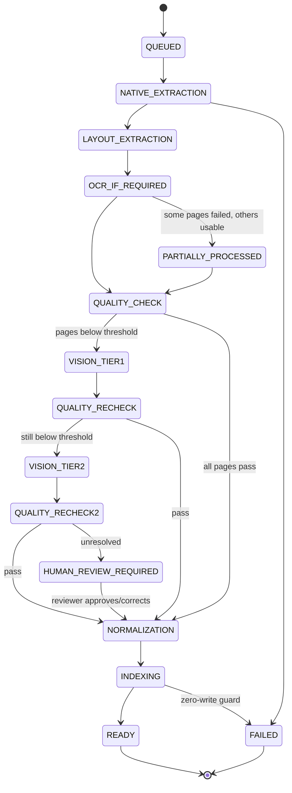

# Contractual knowledge extraction — target design

**Date:** 2026-08-13
**Inputs:** `contraclaim_contractual_knowledge_extraction_master_prompt.md` (the brief) and
`docs/architecture/current_document_enclosure_contract_ingestion_flow_2026-08-13.md` (the
current-state record).
**Status:** design proposal. No code changed. Every claim about current behaviour below is
cited to `file:line` in the checkout at `C:\SaaS\projectDMS`.
**Constraint honoured:** minimum change to the present architecture. The measure of this
design is how much of the brief it satisfies by *moving and reusing* existing modules
rather than adding new ones.

---

## 1. Headline

The brief reads as greenfield. It is not. **The contract path is already ~60% of the target
pipeline** — per-page classification, selective per-page OCR, page evidence records, stable
page provenance links, hierarchical page-grounded chunks, a fail-closed vector guard, and
per-page retry all exist today in `ContractIngestor`.

The actual problem is not "build the pipeline." It is:

> The pipeline exists, but it is **welded to the contract Module** and is invisible to the
> general-document and enclosure paths, which still run a 2019-era whole-document OCR
> heuristic that silently loses pages.

So the minimum-change design is a **single extraction**: lift the page engine out of
`ContractIngestor` into a deep module with a small interface, and call it from all three
intake paths. Almost everything else in the brief then becomes configuration, a payload
field, or a new adapter behind an existing seam.

**Net new dependencies required: zero.** (The brief's PyMuPDF and Docling asks are both
answerable with what is already installed or already containerised — see §2.2, §2.3.)

---

## 2. Grilling the brief against the code

Nine findings. Each changes what should be built.

### 2.1 Marker is already dead — deleting it is a no-op, not a migration

The brief spends a whole section on "Do not introduce Marker." Marker is *already here*
and already inert, twice over:

1. **The binary is not in the image.** `MarkerService._is_available()` gates on
   `shutil.which(cmd[0])` (`contracts_ingest.py:456-462`), config defaults to
   `marker_enabled=True` (`document_processing_config.py:138`) and `.env.example:119` sets
   `MARKER_ENABLED=true` — but `backend/Dockerfile` installs no `marker`. Every contract
   ingest calls `extract_markdown()`, gets `None`, and moves on.
2. **Even when available, its output feeds nothing.** `markdown_text = text` is assigned
   *before* Marker runs (`contracts_ingest.py:1734`); the Marker result is written into
   job-status telemetry (`:1747-1762`) and then **never reassigned to `markdown_text`**.
   Clause extraction consumes `text`/`markdown_text` — i.e. cleaned OCR text — in both the
   AI branch (`:1770`) and the regex branch (`:1783`).

**Consequence:** removing `MarkerService`, `MarkerResult`, `marker_*` config, and the
`MARKER_*` env keys is a **pure deletion with zero behavioural change**. Do it in Phase 0
as cleanup. It is not an architectural decision.

Correction to the current-state doc: its flow chart node *"Marker markdown extraction, when
available"* overstates reality — the node is unreachable in production and inconsequential
if reached.

### 2.2 PyMuPDF should not be added — it is a licence liability and a duplicate

The brief mandates PyMuPDF for Stage 1. Two problems:

- **Not present anywhere.** No project source imports `fitz`/`pymupdf`, and the package is
  installed in neither `.venv` nor `backend/.venv`. A repo-wide sweep matches it only inside
  vendored third-party code that imports it *optionally* (`langchain_classic` PDF loaders,
  `llama_index` readers, `img2pdf`) — so adding it means adding it, not enabling it.
- **PyMuPDF is AGPL-3.0.** Linking it into a closed-source commercial SaaS is a legal
  decision, not an engineering one. It does not belong in an "improve the pipeline" change.

Everything Stage 1 asks for is already installed and permissively licensed:

| Stage-1 requirement | Already available |
|---|---|
| page count, per-page text, words, coordinates, fonts | `pdfplumber==0.11.10` (`backend/rbac_backend/requirements.txt:55`) |
| probable table regions | `pdfplumber` `find_tables()` |
| page raster for vision/thumbnails | `pypdfium2==4.30.0` (root `requirements.txt:200`) — BSD/Apache |
| page tree, rotation, encryption, metadata | `pypdf==6.1.1` |
| OCR | `ocrmypdf==16.10.4` + tesseract in the image (`backend/Dockerfile`) |

**Decision: implement Stage 1 on `pdfplumber` + `pypdf` + `pypdfium2`. Do not add PyMuPDF.**
If a specific measured deficiency later appears, revisit it as its own licence-reviewed change.

### 2.3 Docling is not installed in the backend image, and `services/docling/` does not use Docling

- `docling==2.56.1` appears **only** in the root `requirements.txt:49-52`. The backend image
  installs `rbac_backend/requirements.txt` (`backend/Dockerfile:26-27`), which has **no
  docling**. So the contract-worker cannot import it today. It is also absent from
  `backend/.venv/Lib/site-packages/` — the interpreter CLAUDE.md designates as carrying the
  full dependency set — so a Docling import would fail in local test runs too, not just in
  the container.
- `services/docling/requirements.txt` lists `pytesseract`, `pdfminer.six`, `pypdf`,
  `sentence-transformers`, `qdrant-client` — **not `docling`**. It is a separate,
  differently-implemented OCR service that also writes to Qdrant. It is an unwired parallel
  pipeline, which is exactly what the brief says not to create.
- Importing Docling into the worker pulls torch + layout models: image size, cold start,
  and CPU contention with OCRmyPDF in the same container.

**Decision: Docling stays out-of-process, behind an adapter, off by default.** Reuse the
existing `services/docling/` Dockerfile + CI image as a sidecar with an HTTP interface,
called through a `LayoutExtractor` seam with a timeout and circuit breaker. If the sidecar
is down or slow, the native extractor result stands and the page is marked
`layout_source="native"`. This gives the brief's Stage 2 without making Docling a hard
architectural boundary — which the brief itself asks for.

### 2.4 "GPT-5.6 Luna" and "GPT-5.6 Terra" are not models this system can call

The codebase uses `gpt-4o` and `text-embedding-3-small`
(`document_processing_config.py:113-114`). Hardcoding two invented model names would ship a
pipeline that cannot run.

**Decision: express the two-tier escalation as configurable tiers**, not names:
`VISION_TIER1_MODEL` / `VISION_TIER2_MODEL`, defaulting to the current vision-capable model
for tier 1 and the strongest available for tier 2. The *routing logic* the brief describes
is sound and is what should be built; the model identity is config. Tier-2 escalation must
be a genuinely different model or it is a retry, not an escalation — assert that in config
validation.

Repo convention also applies: any new LLM call producing content that reaches drafting must
pass `strict=True` to `LLMGenerator.generate` with its own deterministic fallback and
degraded marking (`CLAUDE.md`). Vision correction output qualifies.

### 2.5 The general-document OCR gate silently loses evidence — this is a P0, and the brief buries it

`OCRService.is_pdf_textual(pdf_path, max_pages=5)` returns `True` if **any** of the first
five pages yields any text (`ocr_service.py:64-99`). `process_pdf` then copies the original
and extracts a `pdfplumber` sidecar (`:141-151`) — **no OCR at all**.

For the archetypal contractual document — a two-page typed covering letter with 40 scanned
annexure pages — pages 3..42 produce empty text, are stored as `ocrText`, indexed, and
returned by Contract Q&A as though the document contained nothing there. `documents` is the
evidentiary record. This is silent data loss in the exact house-pattern the project already
knows about (`CLAUDE.md`, *"Silent failures are the house pattern here"*).

**This is the single highest-value fix in the whole programme and it is a page-level
decision the contract path already implements correctly** (`contracts_ingest.py:1341-1348`).

### 2.6 Reprocessing orphans vectors — the brief asks for supersession that does not exist

- Contract path **appends**: `_index_clause_vectors` → `insert_document_vectors`
  (`contracts_ingest.py:1848, 1886`) with no prior delete.
- `_build_chunk_id` seeds the UUID5 on `upload_id:clause_number:chunk_index:checksum`
  (`:2316-2318`). Change the text — which OCR retry and any reprocess does — and you get a
  **new point ID**. The old vector stays in Qdrant forever.
- The general path *does* delete first (`database_service.py:509-513`), so the two paths
  disagree.

**Consequence today:** retrying OCR on failed contract pages leaves superseded clause text
searchable. Contract Q&A can cite text that the current conversion no longer contains. This
is a correctness defect in the evidentiary chain and must be fixed by the conversion model
in §4.3, not by a bigger chunker.

### 2.7 General intake admits file types it cannot extract

`ALLOWED_DOCUMENT_MIMES` defaults to PDF/PNG/JPEG/text, but `DocumentProcessor` routes
everything into `OCRService.process_pdf()` (current-state doc §"observed gaps" #2; confirmed
by `ocr_service.py:101` having no type branch). An OCR-enabled PNG upload runs the PDF path.

The shared engine must **dispatch on detected type** and mark unsupported types explicitly
`extraction_unsupported` rather than completing with empty text.

### 2.8 The brief's privacy control is a regression fix, not a new feature

The brief says "do not send the entire document to an external LLM." The general path
**already does exactly that**: when no sidecar text exists it uploads the whole processed
PDF to OpenAI (`document_processor.py:133-134`). So `vision_processing_policy` is not
additive hardening — it closes an existing exposure. Rank it P1, not P3.

### 2.9 The brief's storage layout and queue plan both fight the existing architecture

- **Storage:** `/documents/{id}/conversions/v1/document.md` is a filesystem tree.
  `FileObjectService` is a content-addressed, SHA-256-deduped, multi-provider, RBAC-scoped
  immutable store (`file_object_service.py:81-206`). Building a parallel tree throws away
  dedupe, provider abstraction, and the existing download authorization.
  **Derived artefacts should be `FileObject`s** with `document_type="conversion_artifact"`.
- **Queues:** the brief floats four queues (`document_extract`/`ocr`/`vision`/`index`). The
  repo already runs **two** job systems (Mongo durable jobs for general documents, Redis for
  contracts). Going to six is the opposite of minimum change. The brief itself hedges
  ("only introduce them if the current worker architecture benefits") — it does not.
  **Keep two. Add none.**

---

## 3. Target design in codebase-design terms

### 3.1 The one structural move

```
BEFORE                                  AFTER

DocumentProcessor ──> OCRService        DocumentProcessor ─┐
  (whole-doc heuristic, no pages)                          │
                                                           ├──> PageExtractionEngine
ContractIngestor ──> _extract_pdf_pages_with_ocr_batches   │      (deep module)
  (page-level, correct, but private)   ContractIngestor ───┘

EnclosureController ──> (nothing)       EnclosureController ─────> (same engine, opt-in)
```

`PageExtractionEngine` is the **deep module**: one small interface, a large amount of
behaviour behind it.

**Interface** — everything a caller must know:

```python
async def extract(request: ExtractionRequest) -> ExtractionResult
```

- `ExtractionRequest`: `file_path`, `mime_type`, `scope` (org/project/document/conversion
  ids, initiating user), `policy` (OCR on/off, vision policy, thresholds, budgets),
  `only_pages: list[int] | None` (page-selective reprocess).
- `ExtractionResult`: `pages[]` (number, classification flags, text, `layout_blocks`,
  `bbox`s where available, `source_method`, per-component scores, `status`), `tables[]`,
  `document_quality`, `engine_versions`, `usage` (ocr/tier1/tier2 page counts, tokens, cost),
  `status ∈ {ready, partially_processed, human_review_required, failed}`.
- **Invariants the caller may rely on:** never mutates the source file; is idempotent for a
  given `(conversion_id, page)`; never returns `ready` with zero extracted characters on a
  non-blank document; every page carries a `source_method` and a status; a per-page failure
  degrades that page only.

**Depth check (deletion test):** delete the engine and the page-classification, OCR-routing,
quality-scoring, vision-routing, and provenance logic reappears in `DocumentProcessor`,
`ContractIngestor`, the enclosure controller, the reprocess route, and the human-review
route. It earns its keep.

### 3.2 Seams — and the ones deliberately *not* created

Rule applied: *one adapter means a hypothetical seam; two adapters means a real one.*

| Seam | Adapters (≥2, so it is real) | Why it must vary |
|---|---|---|
| `LayoutExtractor` | `NativeLayoutExtractor` (pdfplumber/pypdf/pypdfium2) · `DoclingHttpExtractor` (sidecar) | Docling must be optional, replaceable, and failure-isolated (§2.3) |
| `OcrEngine` | `OcrMyPdfEngine` · `NullOcrEngine` | OCR is already conditionally disabled; tests need the null path |
| `PageVisionReviewer` | `NullVisionReviewer` (policy `disabled`, and the CI default) · `OpenAIVisionReviewer` (tier 1/tier 2) | Policy per org, and CI must never make a paid call (§2.4) |

**Not seams** (single implementation — a seam here would be shallow indirection):

- The **quality/confidence engine** — pure, deterministic, one implementation. It is a plain
  module *inside* the engine, tested directly. Its thresholds are data, not adapters.
- The **semantic Markdown normalizer** — one implementation. Interface: `ExtractionResult →
  (markdown, canonical_json)`. Pure function; the easiest thing in the whole design to test.

### 3.3 Where the quality engine sits

It is called **twice on the same interface** — once before vision, once after
(`brief` Stage 4 and Stage 6). One implementation, two call sites, which is the point:
"do not trust the model's own confidence" is enforced structurally, because the post-vision
gate is the *same deterministic code* as the pre-vision gate.

Component scores (retain all; compute a weighted overall but never discard the parts):
`text_coverage`, `ocr_confidence`, `reading_order`, `table_integrity`, `numeric_integrity`,
`layout`, `source_alignment`, `missing_region`, `entity_integrity`.

Numeric integrity checks are deterministic and run **before** any LLM call:
`qty × rate ≈ amount`, `subtotal ≈ Σ items`, `total ≈ Σ subtotals`, decimal/comma placement,
sign consistency. A failure **flags and escalates the region — it never rewrites a value.**

Contract-aware thresholds (config, per environment, per org where entitlements allow):

| Content class | Auto-accept |
|---|---|
| narrative | ≥ 0.90 |
| clause / legal | ≥ 0.94 |
| dates / key-date tables | ≥ 0.96 |
| financial / quantity / rate | ≥ 0.97 |
| handwritten, annotated, poor scan | vision review by default |

---

## 4. Target flow

### 4.1 End-to-end

```mermaid
flowchart TD
    up["Upload: general document, enclosure, or contract"] --> gate["Existing intake gate:<br/>authorize scope, spool, size, MIME, ClamAV, meter"]
    gate --> dup{"SHA-256 duplicate precheck<br/>(existing duplicate_detection)"}
    dup -->|"exact match"| block["409, audit, no extraction cost"]
    dup -->|"new / possible duplicate"| store["FileObjectService stores immutable original<br/>(unchanged — evidentiary source)"]
    store --> rec["Mongo: documents + document_versions<br/>+ NEW document_conversions (v_n, status=queued)"]
    rec --> q["Existing queue:<br/>Mongo durable job (general) OR Redis (contract)"]
    q --> eng["PageExtractionEngine.extract()"]

    subgraph eng_box["PageExtractionEngine — one deep module, called by all three paths"]
        direction TB
        s1["Stage 1 — Native inspection (pdfplumber / pypdf / pypdfium2)<br/>per page: text, words, bbox, fonts, rotation, image coverage, table regions"]
        s1 --> cls["Per-page classification (multi-flag):<br/>DIGITAL_TEXT · SCANNED_IMAGE · MIXED · TABLE_HEAVY · DRAWING · LOW_QUALITY · HANDWRITTEN"]
        cls --> s2{"Layout extraction worth it?<br/>(TABLE_HEAVY / MIXED / low reading-order)"}
        s2 -->|"yes, sidecar healthy"| dl["DoclingHttpExtractor (sidecar, timeout + circuit breaker)"]
        s2 -->|"no, or breaker open"| nat["NativeLayoutExtractor result stands<br/>layout_source=native"]
        dl --> s3
        nat --> s3
        s3{"Per-page OCR needed?<br/>text < min_chars_per_page"} -->|"no"| keep["keep native page text"]
        s3 -->|"yes"| ocr["OcrMyPdfEngine on contiguous page batches only<br/>(meter UsageEventType.OCR_PAGE)"]
        keep --> qc1
        ocr --> qc1
        qc1["QualityEngine.score(page) — deterministic<br/>coverage · reading order · table · NUMERIC INTEGRITY · entity integrity"]
        qc1 --> rt{"Per-page routing vs content-class threshold"}
        rt -->|"pass"| acc["accept page"]
        rt -->|"below threshold AND policy allows AND budget left"| v1["PageVisionReviewer tier 1<br/>page image + native + layout + OCR + named defects<br/>structured corrections only"]
        rt -->|"policy=disabled OR budget exhausted"| hr["status = HUMAN_REVIEW_REQUIRED"]
        v1 --> qc2["QualityEngine.score again — SAME deterministic code"]
        qc2 -->|"pass"| acc
        qc2 -->|"still low"| v2["PageVisionReviewer tier 2 (different model)"]
        v2 --> qc3["QualityEngine.score again"]
        qc3 -->|"pass"| acc
        qc3 -->|"still low"| hr
    end

    acc --> norm["ContraClaim Semantic Normalizer<br/>(pure: ExtractionResult -> markdown + canonical JSON)"]
    hr --> norm
    norm --> art["Artefacts written as FileObjects<br/>document_type=conversion_artifact<br/>(markdown · canonical JSON · audit · page images)"]
    art --> pages["Mongo: document_pages (per-page evidence, scores, status, provenance)"]
    pages --> chunk["Hierarchical chunking<br/>heading+narrative · table+title · clause+subclauses kept together"]
    chunk --> swap["ATOMIC ACTIVATION:<br/>1. write new conversion_id vectors<br/>2. flip documents.active_conversion_id<br/>3. delete vectors of the superseded conversion"]
    swap --> guard{"Qdrant enabled, chunks built, zero written?"}
    guard -->|"yes"| fail["FAIL job — do not mark ready<br/>(existing guard, generalised)"]
    guard -->|"no"| ready["conversion ACTIVE; graph + reference sync;<br/>document READY"]
    ready --> cons["Contract Q&A · Drafting · Chronology · Arbitration<br/>every citation resolves to conversion_id + page + bbox"]
```



### 4.2 Conversion state machine

Persisted on `document_conversions.status`; each transition is a checkpoint so a worker
crash resumes at the last completed stage rather than page 1.



`PARTIALLY_PROCESSED` is deliberate: a failure on page 37 must not discard pages 1–36.
Existing per-page OCR retry (`contracts_ingest` retry interface) generalises to
"re-run these page numbers in this conversion."

### 4.3 The three representations, and how they map onto existing storage

```
original_file            = FileObject (immutable, SHA-256)        ← unchanged, already exists
canonical JSON           = FileObject, document_type="conversion_artifact"
semantic Markdown        = FileObject, document_type="conversion_artifact"
per-page evidence        = Mongo document_pages                   ← generalised from contract_ocr_pages
conversion bookkeeping   = Mongo document_conversions             ← NEW, small
```

**Do not overload `document_versions`.** It means "the user supplied a new file"
(`storage_architecture.py:65-76`); a conversion means "we re-extracted the same file." Two
lifecycles, two collections. One `document_version` has N `document_conversions`, exactly one
of which is active.

---

## 5. Schema changes (small, additive, reversible)

### 5.1 New: `document_conversions`

```
_id, document_id, document_version_id, conversion_version (int),
organization_id, project_id,                        # scope carried into every job
status,                                             # the state machine in §4.2
engine_versions: { native, layout, ocr, vision_tier1, vision_tier2, normalizer, chunker, prompt },
policy_snapshot: { thresholds, vision_policy, budgets },
page_summary: { total, native_only, layout, ocr, tier1, tier2, human_review },
usage: { input_tokens, output_tokens, estimated_cost, processing_seconds },
artifacts: { markdown_file_object_id, json_file_object_id, audit_file_object_id },
overall_confidence, created_by, createdAt, activatedAt, supersededAt
```

### 5.2 New: `document_pages`

Generalise `contract_ocr_pages` (`contracts_ingest.py:1294-1300`) — it already has
`page_number`, raw/cleaned text, status, batch, error, and `source_pdf_page_link`. Add:
`conversion_id`, `classification[]`, `scores{}`, `source_method`, `layout_source`,
`bbox_index`, `vision_corrections[]` (before/after/reason/model/confidence — never a silent
overwrite), `review{reviewer_id, at, action}`.

Migration: create `document_pages`, backfill from `contract_ocr_pages`, dual-read for one
release, then retire the old collection. The existing OCR-retry route keeps working
throughout.

### 5.3 Changed: `documents`

Add `active_conversion_id`, `extraction_status`, `overall_confidence`. Nothing removed.

### 5.4 Config

Add: `LAYOUT_EXTRACTOR` (`native|docling`), `DOCLING_URL`, `DOCLING_TIMEOUT_S`,
`VISION_PROCESSING_POLICY` (`disabled|selective|allowed_for_all`, **default `disabled`**),
`VISION_TIER1_MODEL`, `VISION_TIER2_MODEL`, `MAX_TIER1_PAGES_PER_DOCUMENT`,
`MAX_TIER2_PAGES_PER_DOCUMENT`, `MAX_VISION_COST_PER_DOCUMENT`, plus the five confidence
thresholds.
Remove: `MARKER_ENABLED`, `MARKER_CMD`, `MARKER_OUTPUT_DIR` (§2.1 — no behaviour change).

### 5.5 Cost control reuses the existing entitlement seam

`UsageEventType` + `UsageMeteringService.check_and_record` already enforce org/project-scoped
monthly limits and are already called for OCR pages
(`usage_metering_service.py:21-46`, `contracts_ingest.py:1360-1372`).

Add `VISION_PAGE = "limit.vision_pages_month"` and call the same interface. Per-document caps
live in the policy snapshot; per-org caps come free from `EntitlementService`. **No new
billing or limits subsystem.** When a cap is reached the page routes to
`HUMAN_REVIEW_REQUIRED` — never silently over-spends, never silently degrades.

---

## 6. RBAC — no new surface

The engine takes scope in `ExtractionRequest` and **never queries `db.roles`**. Rules:

- Every conversion, page, artefact FileObject, and Qdrant point carries
  `organization_id` + `project_id`. Qdrant filters are unchanged in shape.
- New routes (`GET conversions`, `GET pages`, markdown/JSON download, `POST reprocess`,
  human-review approve) use `PolicyService.authorize(...)`; list endpoints use
  `build_scope_query(...)`. A scope refusal returns **403, never 401** — the client force-logs-out
  on 401 (`CLAUDE.md`).
- Reprocess and human-review approval are mutating and need their own permissions:
  `dms.document.reprocess`, `dms.document.review_extraction`.
- Conversion IDs are opaque and always re-authorized server-side — never a bearer of access.
- **Regenerate the route contract** after adding routes, or
  `test_route_authz_gate_evidence.py` / `test_route_control_manifest.py` fail:

```bash
backend/.venv/Scripts/python.exe scripts/rbac_phase0_route_inventory.py --format contract-json --output backend/rbac_backend/route_control_manifest.json
```

---

## 7. Phased plan

Ordered by **defect severity first**, not by the brief's stage numbering. Phases 0–3 deliver
the entire integrity win with no LLM spend and no new dependency.

| Phase | Work | Why here | Risk |
|---|---|---|---|
| **0** | Delete Marker (§2.1). Add `document_conversions` + `document_pages` + `active_conversion_id`. Migration dry-run. | Pure cleanup + empty scaffolding. Nothing reads it yet. | none |
| **1** | Extract `PageExtractionEngine` from `ContractIngestor`; contract path calls it. Behaviour-identical; existing contract tests are the regression gate. | Proves the interface against the harder caller first. | medium — pure refactor, covered by existing suite |
| **2** | **Route the general-document path through the engine.** Kills the 5-page heuristic (§2.5) and the MIME mismatch (§2.7). General documents get page evidence + provenance. | **Highest value in the programme.** Stops silent evidence loss. | medium |
| **3** | Quality engine + numeric/entity integrity + `PARTIALLY_PROCESSED` + fail-visible statuses. Deterministic only — no LLM. | All the confidence machinery, zero cost, fully unit-testable. | low |
| **4** | Conversion activation + supersession (§2.6). Atomic `active_conversion_id` flip, then delete superseded vectors. Generalise the zero-write guard. | Fixes orphaned vectors; makes reprocessing safe. | medium — touches Qdrant |
| **5** | Semantic normalizer → markdown + canonical JSON as FileObjects. Hierarchical chunking that keeps heading+narrative, table+title, clause+subclauses together. | Depends on 1–4 being solid. | low |
| **6** | `PageVisionReviewer` seam. `NullVisionReviewer` default. Tier 1 → recheck → tier 2 → human review. Budgets via `UsageEventType.VISION_PAGE`. Policy default **disabled**. | Last, because everything before it reduces how often it fires. | high — cost + external calls |
| **7** | `DoclingHttpExtractor` sidecar, off by default, circuit-breakered. Enable per-org after benchmark. | Optional accelerant, not a dependency. | medium |
| **8** | UI: processing stepper, Document Library `Original / Extracted / Markdown / Tables / Metadata / Processing` tabs, human-review side-by-side, superadmin diagnostics. | Needs stable data. | low |
| **9** | Enclosure opt-in extraction (same engine, `extract_enclosures` flag). | Closes the third path. | low |
| **10** | Controlled backfill: dry-run → cost/time/storage estimate → batch → rollback. Never bulk-reprocess the corpus. | Last. | high |

**Rollback:** every phase is a flag or an additive collection. Phase 2 keeps the legacy
`OCRService` path behind `EXTRACTION_ENGINE=legacy|unified` for one release. Phases 6–7
default off; disabling them returns the deterministic pipeline.

---

## 8. Testing — the gates that must exist

Beyond the brief's list, three that the *repo's own* failure history demands:

1. **Dependency-injection trap.** Router tests override `get_*_controller` factories, so a
   broken factory ships past a green suite (`CLAUDE.md`; the `GET /api/organizations`
   outage). The engine must have at least one test that constructs the **real** factory.
2. **Event-loop hygiene.** Backend async tests each get their own `asyncio.run` loop and
   async fixtures are unsupported. Any module-level Motor global in the engine must be
   cleared between tests or it passes alone and fails in suite.
3. **Fail-visible assertions.** For each of: OCR failure, Docling timeout, vision timeout,
   Qdrant down, budget exhausted — assert the document reaches a **visible non-ready
   status**, never `ready` with empty or stale content. This is the class of defect that has
   bitten this codebase repeatedly (Qdrant 401 vector loss; ingest marked complete at 0 chunks).

Contractual integrity fixtures must assert exact preservation — `₹22,140,168` must never
become `₹2,214,016.8` — and vision routing must be asserted with **mocked** model calls
(`NullVisionReviewer` in CI; zero paid calls).

Commands:

```bash
backend/.venv/Scripts/python.exe -m pytest backend/rbac_backend/tests -q
```

```bash
cd backend && python -m rbac_backend.scripts.migrate_database --list && python -m rbac_backend.scripts.migrate_database --fail-on-warning
```

---

## 9. What this design refuses to build

| Brief asks for | Decision | Reason |
|---|---|---|
| PyMuPDF | **No** | AGPL in a commercial SaaS; duplicates pdfplumber/pypdf/pypdfium2 (§2.2) |
| Docling imported into the worker | **No** — sidecar behind an adapter | torch + models in the OCR container; keeps Docling replaceable (§2.3) |
| `GPT-5.6 Luna` / `Terra` by name | **No** — configurable tiers | those model names do not exist here (§2.4) |
| Four new queues | **No** | two job systems already; brief itself says only if it helps (§2.9) |
| `/documents/{id}/conversions/v1/` filesystem tree | **No** — artefacts are FileObjects | reuses dedupe, providers, RBAC, downloads (§2.9) |
| Overloading `document_versions` for conversions | **No** — separate collection | different lifecycle (§4.3) |
| Whole-document LLM extraction | **Removed** | already an active data-exposure path (§2.8) |
| Marker | **Deleted** | already inert; deletion is behaviour-neutral (§2.1) |

---

## 10. Open questions for the product owner

These change the work materially and I have not assumed answers:

1. **Vision spend.** What is the acceptable ceiling per document and per org/month? The
   design routes to human review at the cap rather than over-spending — that is a product
   decision about which failure the user prefers.
2. **External-model policy.** Should `VISION_PROCESSING_POLICY` be settable per organization
   (some clients may contractually forbid sending contract pages to a third party), or a
   single deployment-wide setting? Per-org is more work but fits the entitlement model.
3. **Backfill appetite.** Existing production documents were extracted under the 5-page
   heuristic and may be missing pages. Re-extraction is the only way to find out, and it
   costs. Sampling first, or full backfill?
4. **Enclosures.** Today they are storage-only and the UI does not even expose upload. Should
   Phase 9 happen at all, or should enclosures stay evidentiary-but-unindexed?

---

## 11. Traceability to the brief's acceptance criteria

| Brief criterion | Met by |
|---|---|
| Existing architecture reused, no competing pipeline | §3.1 — one engine, three callers; §2.3 rejects the `services/docling` parallel path |
| FastAPI does no heavy conversion; workers own it | unchanged — existing Mongo + Redis job systems (§2.9) |
| Marker not introduced | §2.1 — deleted, behaviour-neutral |
| Original unchanged, SHA-256 retained, chunks traceable | §4.3 — FileObject untouched; `conversion_id + page + bbox` on every chunk |
| Conversion history versioned | §5.1 `document_conversions`, never overwritten |
| Native extraction where reliable; selective OCR | §4.1 Stage 1/3, page-level (§2.5 fix) |
| Component + page confidence; class-dependent thresholds | §3.3 |
| Numeric integrity checks | §3.3 — deterministic, pre-LLM, flag-never-rewrite |
| Selective tier-1 → tier-2 → human review | §4.1, §4.2 |
| High-confidence pages cost nothing | routing gate is deterministic and runs first |
| Token/cost stored; limits enforceable | §5.1 `usage`, §5.5 existing metering seam |
| Hierarchical chunking; org/project/page/conversion in Qdrant | §4.1; contract path already carries page grounding (`contracts_ingest.py:2292-2298`) |
| Old conversion vectors safely superseded | §4.1 atomic activation — **fixes §2.6** |
| Entities preserved; uncertainty stays marked | §3.3 entity integrity; `vision_corrections[]` keeps before/after/reason/model |
| RBAC on all artefacts; no background bypass | §6 |
| Audit: methods, versions, LLM calls, human corrections | §5.1 `engine_versions`, §5.2 `vision_corrections`/`review` |
| Idempotent retry; large-PDF behaviour; metrics | §4.2 checkpoints + `PARTIALLY_PROCESSED`; §8 |

---

## 12. Honest limits of this document

- **Verified:** every `file:line` claim in §2 was read in this session in the current
  checkout. The Marker findings (§2.1), the OCR gate (§2.5), the missing vector supersession
  (§2.6), the whole-PDF upload (§2.8), and the dependency inventory (§2.2, §2.3) are
  confirmed by direct reading, not inferred from the current-state document.
- **Corrected during review:** an earlier reading suggested AI clause extraction was gated
  behind Marker. It is not — `markdown_text` is assigned from `text` at
  `contracts_ingest.py:1734` and the AI branch runs on cleaned text regardless. The Marker
  finding stands on the two grounds in §2.1, not on that one.
- **Not verified:** production runtime behaviour. Nothing here was checked against the live
  `contraclaim.com` stack, no migration was dry-run, and no benchmark exists yet. The
  page-loss claim in §2.5 is a reading of the code path; **its production blast radius is
  unmeasured** and should be quantified in Phase 0 by sampling existing documents for pages
  with zero extracted characters.
- **Estimates:** none given. Phase sizing is ordering and risk, not schedule.
