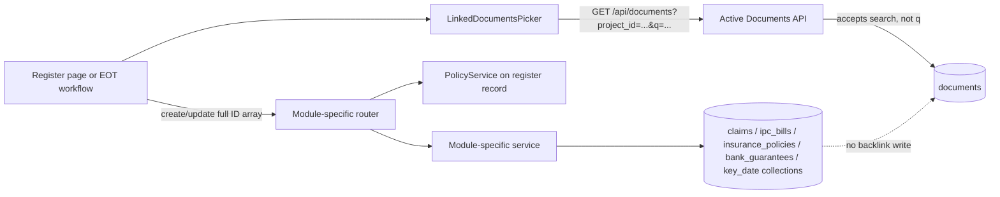
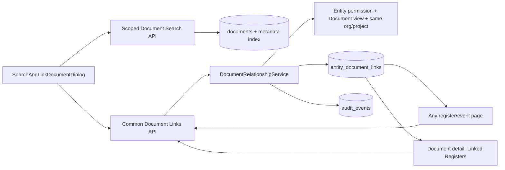

# ContraClaim DMS Cross-Register Document Linking Audit

**Audit date:** 17 August 2026

**Scope:** Current checked-in frontend, backend, MongoDB models/index wiring, APIs, document metadata/search, RBAC/scope enforcement, deletion behavior, audit history, and tests for Claims, IPC/Payments, Insurance, Bank Guarantees, Key Dates/Milestones, and Contract Master.

**Boundary:** Repository audit only. No source implementation, migration, graph rebuild, deployment, or production-data inspection was performed.

## 1. Executive conclusion

ContraClaim does **not** currently have a complete, reusable, bidirectional document-linking framework for registers.

There are useful building blocks:

- most register models already expose a flat `linked_document_ids` array;
- IPC and the Key Date EOT revision workflow use a reusable `LinkedDocumentsPicker`;
- the Document Library has tenant-scoped listing and rich document metadata;
- document-to-document references maintain `references` and `referencedBy` arrays;
- module CRUD is generally protected by `PolicyService` and emits coarse-grained audit events.

However, the requested outcome is not achieved because:

1. register links are embedded ID arrays, not authoritative relationship records;
2. no register link writes a backlink visible from the Document Library;
3. most register write paths do not validate document existence, lifecycle state, organisation, project, or document-view permission;
4. the shared picker sends `q`, while the active `/documents` API accepts `search`, so the server ignores the search term;
5. the picker only client-filters the first returned page by document name and exposes none of the required structured filters;
6. deletion cleanup covers document-to-document references but not register `linked_document_ids` arrays;
7. Insurance creates a separate uploaded policy file outside the Document Library, contrary to the desired single source of truth;
8. Bank Guarantee evidence is not retained per lifecycle event;
9. Contract Master has no document relationship fields or UI;
10. audit events are record-level before/after snapshots, not immutable, explicit link/unlink events.

**Overall status: Partially Implemented, with no requested module fully implemented end to end.**

The recommended correction is one tenant-scoped `entity_document_links` collection and one `DocumentRelationshipService`, used by all modules and by the Document detail reverse lookup. Bank Guarantee lifecycle changes should be first-class event records that use this same relationship service.

## 2. Audit method and active wiring

The existing Graphify graph was queried first as an orientation map. Every finding below was then checked against current source. The active backend imports routers from `rbac_backend.routers` and mounts Documents plus all six target modules under `/api` (`backend/rbac_backend/main.py:12-37`, `:222-232`). The legacy `backend/rbac_backend/documents.py` module is not the mounted Documents router.

The frontend routes load all six requested pages (`client/src/routes.tsx:55-66`, `:79`, `:203-269`, `:384-387`).

This report describes checked-in behavior. Runtime database contents and production deployment state were not inspected.

## 3. Current implementation status by module

| Module | Overall status | Forward link storage | Search/link UI | Reverse links in Document Library | Event-specific evidence |
|---|---|---|---|---|---|
| Claim Register | **Partially Implemented** | Flat `linked_document_ids` and `linked_letter_ids` | **Not implemented** on create/edit; detail is read-only | **Not implemented** | **Not implemented**; all evidence shares one flat list |
| IPC / Payment Register | **Partially Implemented** | Flat `linked_document_ids` | Picker exists in edit dialog, but server search is ineffective and linked badges are not direct links | **Not implemented** | **Not implemented**; no roles for submission/certification/invoice/payment |
| Insurance Register | **Partially Implemented** | Flat unused `linked_document_ids` plus a separate file token | Common Search and Link is **not implemented**; new upload is required on create | **Not implemented** | **Not implemented**; no renewal/endorsement/certificate event history |
| Bank Guarantee Register | **Partially Implemented at schema level** | One flat top-level `linked_document_ids` | **Not implemented** | **Not implemented** | **Not implemented**; extension overwrites the top-level list and other event types lack evidence records |
| Key Dates / Milestones | **Partially Implemented** | Milestone, EOT, achievement, submission, and determination records contain ID arrays | Picker exists only for the newer EOT submission/determination workflow | **Not implemented** | EOT revisions partly supported; achievement/notification evidence UI is **not implemented** |
| Contract Master | **Not Implemented** | No document relationship fields | **Not implemented** | **Not implemented** | No LOI/LOA/agreement/GCC/SCC/specification/BOQ/addendum roles |

### 3.1 Claim Register

#### Implemented

- `ClaimBase` contains `linked_document_ids` and `linked_letter_ids` (`backend/rbac_backend/models/claim.py:39-62`).
- The API returns these arrays through `Claim` and accepts them through `ClaimCreate` and `ClaimUpdate` (`backend/rbac_backend/models/claim.py:65-100`).
- Claim CRUD is mounted, permission-gated, and tenant-scoped for list/read/update/delete (`backend/rbac_backend/routers/claims.py:35-145`).
- `ClaimService` emits `claim.created`, `claim.updated`, and `claim.deleted` audit events with actor and record snapshots (`backend/rbac_backend/services/claim_service.py:28-108`).
- Claim detail renders existing IDs as Document Viewer links (`client/src/pages/ClaimDetailPage.tsx:194-208`).
- Evidence bundle generation attempts to include `linked_document_ids` and rejects other-organisation documents (`backend/rbac_backend/services/evidence_bundle_service.py:117-143`).

#### Partially implemented

- The detail page can view the flat list, but it shows `Document {id}` rather than document metadata and offers no add/remove workflow.
- Generic create/update APIs can carry IDs, but the Claims Register page has no reusable picker and does not manage the arrays.
- Coarse claim update audit snapshots can be compared to infer a link-list change, but there is no explicit `document_link.created` or `document_link.removed` event.

#### Not implemented / issues

- No classification distinguishes notice, claim submission, supporting evidence, Engineer response, Employer response, determination, or correspondence.
- Create/update do not validate linked IDs against `documents`, document lifecycle state, organisation, project, or the caller's `DOCUMENT_VIEW` permission.
- There is no reverse lookup on the Document detail page.
- Evidence bundle lookup uses `db.documents.find_one({"_id": doc_id})` with the stored string directly (`evidence_bundle_service.py:122-128`). Normal ObjectId-backed documents can therefore be reported as not found unless legacy string IDs are used.
- The evidence bundle checks organisation but not project (`evidence_bundle_service.py:120-133`).
- Claim deletion hard-deletes the record but has no common relationship cleanup because relationships are not first-class records.

### 3.2 IPC / Payment Register

#### Implemented

- `IPCBillBase` and `IPCBillUpdate` expose `linked_document_ids` (`backend/rbac_backend/models/ipc_bill.py:176-207`, `:214-237`).
- The frontend DTO preserves the array (`client/src/services/ipc-bills-api.ts:92-112`, `:137-157`, `:176-183`).
- The edit/create dialog includes `LinkedDocumentsPicker` and persists selected IDs with the IPC payload (`client/src/pages/IPCBillRegisterPage.tsx:33`, `:190-205`, `:214-239`, `:498-505`).
- IPC CRUD is permission-gated and list/read operations are tenant-scoped (`backend/rbac_backend/routers/ipc_bills.py:38-73`, `:128-180`).
- Updates append an IPC revision and emit record-level audit events (`backend/rbac_backend/services/ipc_bill_service.py:214-240`, `:264-274`).

#### Partially implemented

- Users can select multiple documents while editing an IPC.
- The UI removes IDs locally and persists the complete replacement list when the IPC is saved.
- The same flat list can contain any IPC evidence, but no semantic role identifies what each document proves.

#### Not implemented / issues

- The picker sends `q`, not the active API's `search` parameter; server-side matching does not occur.
- Search results are then filtered only by `name`/`filename` from the first 25 returned records (`client/src/components/documents/LinkedDocumentsPicker.tsx:57-65`).
- Existing linked names are resolved by loading only the first 200 project documents (`LinkedDocumentsPicker.tsx:41-55`); older links may render as raw IDs.
- Linked badges are not clickable, so the register does not directly open selected documents (`LinkedDocumentsPicker.tsx:75-85`).
- IPC create/update do not validate document existence or scope before persisting IDs.
- The router checks IPC create/edit permission but not `DOCUMENT_VIEW` for each submitted ID.
- There is no reverse Document Library relationship.
- There are no document roles for IPC submission, certified IPC, invoice, payment certificate, support, or payment correspondence.
- IPC revisions record status/remarks, not document-link deltas as explicit evidence history (`ipc_bill.py:168-174`; `ipc_bill_service.py:217-233`).
- No `ipc_bills` indexes are created in `core/database.py`, including no index for linked IDs or register scope.

### 3.3 Insurance Register

#### Implemented

- The model contains `linked_document_ids` (`backend/rbac_backend/models/insurance.py:43-61`, `:70-84`).
- CRUD is permission-gated and list operations are scope-filtered (`backend/rbac_backend/routers/insurance.py:64-157`, `:233-370`).
- Record create/update/file-replace/delete operations emit audit events (`backend/rbac_backend/services/insurance_service.py:142-159`, `:194-243`, `:263-269`).
- A primary policy file can be uploaded, previewed, downloaded, and replaced.

#### Partially implemented

- A policy record can carry a primary file token and a separate unused flat list of Document Library IDs.
- The API accepts `linked_document_ids`, but the active page does not expose them.

#### Not implemented / issues

- Create requires a fresh upload (`client/src/pages/InsuranceRegisterPage.tsx:273-280`) instead of allowing selection of an existing Document Library item.
- `/insurance/upload` writes bytes to `UPLOADS_DIR/insurance` and returns a random filename token, not a Document Library `_id` (`backend/rbac_backend/routers/insurance.py:36-57`, `:251-295`). This is a separate document store and violates the requested single source of truth.
- The Insurance page has no `LinkedDocumentsPicker`; it manages only `document_id`, name, and content type (`InsuranceRegisterPage.tsx:100-112`, `:216-269`, `:576-584`).
- No renewal, extension, endorsement, certificate, correspondence, or support event/history model exists.
- `linked_document_ids` are not validated for scope or lifecycle.
- Deleting an Insurance record deletes only the Mongo record (`insurance_service.py:239-243`); it does not remove the stored policy file, creating orphan-file risk.
- Replacing a file updates the token but does not delete or retain an explicit immutable version relationship for the prior file (`insurance_service.py:215-237`).
- No reverse links appear on a Document detail page because the primary file is not a Document Library item and the ID array has no backlink mechanism.

### 3.4 Bank Guarantee Register

#### Implemented

- The base and update models contain a flat `linked_document_ids` list (`backend/rbac_backend/models/bank_guarantee.py:40-60`, `:67-83`).
- `BGExtendRequest` accepts `linked_document_ids` (`bank_guarantee.py:85-93`).
- Extension history records dates, letter reference, remarks, creator, and revision number (`bank_guarantee.py:118-135`).
- CRUD, extend, release, and history routes are separately permission-gated (`backend/rbac_backend/routers/bank_guarantees.py:232-315`).
- Service operations emit record-level audit events.

#### Partially implemented

- An extension request can replace the Bank Guarantee's top-level linked document list (`backend/rbac_backend/services/bank_guarantee_service.py:237-270`).
- Extension history is immutable as a date/reference log, but not as documentary evidence history.

#### Not implemented / issues

- The frontend page has no document selector and does not expose the flat link list.
- There are no separate event records for original/submission, amendment, reduction, or release/discharge.
- `BGExtensionHistory` has no `linked_document_ids`; extension evidence is therefore not retained on the immutable extension event.
- An extension updates the top-level list, which can overwrite or mix original, earlier extension, and current extension evidence (`bank_guarantee_service.py:266-268`).
- `BGReleaseRequest` defines `release_letter_reference` and `release_date` (`bank_guarantee.py:95-99`), but the active router passes only `remarks` to the service (`bank_guarantees.py:295-304`). Release evidence and date/reference are discarded.
- Amendment and reduction workflows are absent.
- No link existence/scope/lifecycle validation or reverse lookup exists.
- Deleting a BG leaves its `bg_extension_history` rows unless separately cleaned; the service deletes only `bank_guarantees` (`bank_guarantee_service.py:231-235`).

### 3.5 Key Dates / Milestones

#### Implemented

- Milestones, EOT applications, achievements, EOT submissions, and determinations contain document ID lists (`backend/rbac_backend/models/key_date.py:99-133`, `:182-227`, `:259-267`, `:332-395`, `:424-451`).
- The newer EOT revision workflow uses `LinkedDocumentsPicker` for Contractor submissions and Employer determinations (`client/src/components/key-dates/KeyDateRevisionWorkflow.tsx:539-545`, `:597-603`).
- `KeyDateRevisionService._assert_links_in_scope` validates ObjectId shape plus matching organisation/project for EOT revision submissions and determinations (`backend/rbac_backend/services/key_date_revision_service.py:220-258`).
- Locked submissions and frozen determinations disable picker mutation in the UI.
- Achievement records are stored separately in `key_date_achievements` and the milestone receives an achievement summary (`backend/rbac_backend/services/key_date_service.py:637-642`).

#### Partially implemented

- EOT submission and determination documents can be selected and stored.
- Milestone and achievement models are structurally ready to carry document IDs.

#### Not implemented / issues

- The requested achievement/completion evidence workflow is absent from the UI. The achievement dialog posts date, remarks, and notification reference/date but no `linked_document_ids` (`client/src/pages/KeyDateDetailPage.tsx:67-68`, `:142-159`, `:426-465`).
- The older per-milestone EOT submit/review dialogs similarly capture letter references but not linked documents (`KeyDateDetailPage.tsx:61-68`, `:92-131`, `:353-423`).
- Main milestone create/update and achievement write paths do not call the EOT revision service's scope validator.
- `_assert_links_in_scope` claims to reject deleted documents, but its query does not filter `lifecycle_state` (`key_date_revision_service.py:228-253`). A soft-deleted document can still pass if it remains in `documents`.
- EOT submission/determination links still have no Document Library reverse relationship or explicit link/unlink audit record.
- No roles identify Contractor notification, Engineer acknowledgement, completion certificate, inspection record, or other achievement evidence.
- The achievement record written by `record_achievement` includes linked IDs and `created_at`, but the `keydate.achievement.recorded` audit event contains only timing results, not the link list (`key_date_service.py:637-642`).

### 3.6 Contract Master

#### Implemented

- Contract Master is an active, tenant-scoped, audited register for contract values, dates, currencies, and BG validity rules (`backend/rbac_backend/models/contract_master.py:1-7`; `backend/rbac_backend/services/contract_master_service.py:97-195`; `backend/rbac_backend/routers/contract_master.py:33-115`).
- The page links to the separate Contract Viewer (`client/src/pages/ContractMasterPage.tsx:220-230`).

#### Not implemented / issues

- No model or API field represents Contract Master document links.
- No Search and Link UI exists.
- LOI, LOA, Contract Agreement, GCC, SCC, Technical Specifications, BOQ/Schedules, Addenda, and Amendments have no relationship roles.
- `contract_start_date` is labelled as LOA date, but it is only a date value, not a relationship to the authoritative LOA document (`contract_master.py:68-82`; `ContractMasterPage.tsx:263-270`).
- The separate Contract Viewer/ingestion flow is not a Contract Master relationship and cannot produce reverse register links.

## 4. Existing architecture and data flow

### 4.1 Register link flow



The current relationship is merely an ID copied into the owning register record. There is no common relationship service in this flow.

### 4.2 Document-to-document flow

The Document model has `references` and `referencedBy`, and each `DocumentReference` records `linkedAt`, `linkedBy`, type, source, and metadata (`backend/rbac_backend/models/document.py:10-18`, `:60-132`).

The active flow is:

- `POST /api/documents/{id}/references` or `/api/documents/link`;
- source requires `DOCUMENT_LINK_REFERENCE`, target requires `DOCUMENT_VIEW` (`backend/rbac_backend/routers/documents.py:2011-2040`, `:2816-2862`);
- `DocumentService.add_reference` calls `ReferenceSyncService.sync_bidirectional`, updating `references` and `referencedBy` and refreshing Falkor (`backend/rbac_backend/services/document_service.py:2071-2141`);
- remove updates both arrays and Falkor (`document_service.py:2143-2198`).

This is document-to-document reference chaining, not register-to-document evidence linking. It should not be copied separately into every register.

### 4.3 Duplicate/legacy mechanisms

Four inconsistent mechanisms coexist:

1. **Active document references:** `DocumentService` + `ReferenceSyncService`, bidirectional arrays.
2. **Register ID arrays:** module services write `linked_document_ids` without backlinks.
3. **Insurance file tokens:** bytes stored under `uploads/insurance`, outside the Document Library.
4. **Legacy document router/service:** `backend/rbac_backend/documents.py` imports `DocumentLinkingService` and defines a second `/documents/link` schema/implementation, but `main.py` mounts `rbac_backend.routers.documents`, not this legacy module. The legacy request schema uses `document_a_id/document_b_id` and `incoming/outgoing`, while the active schema uses `source_document_id/target_document_id` and `direct/indirect`.

Frontend duplication also exists:

- `LinkedDocumentsPicker` is a simple register/EOT selector that only returns IDs.
- `LinkedDocumentSelector` is a larger drafting-context selector with suggestions, persistence to letter context, and direct document links (`client/src/components/letter-workflow/LinkedDocumentSelector.tsx`).
- Both send `q` to `listDocuments`, so both miss the active backend's `search` parameter (`LinkedDocumentSelector.tsx:184-200`; `LinkedDocumentsPicker.tsx:57-65`; `documents-api.ts:20-31`; `routers/documents.py:2601-2633`).

## 5. Common gaps and risks

### 5.1 Search does not meet the requirement

The active Documents API supports filters for organisation, project, tags, subtags, upload type, status, `search`, dates, letter number, and subject (`backend/rbac_backend/routers/documents.py:2601-2633`). Its `search` implementation matches filename, subject, letter number, sender, and recipient (`backend/rbac_backend/services/authorization_service.py:580-606`).

The register picker:

- sends `q`, which is not an endpoint parameter;
- filters only `name`/`filename` client-side;
- has no UI filters for date, document type, sender, recipient, organisation, tags, or keywords;
- does not search `full_text`, `keywords`, `additional_keywords`, or extracted metadata, even though the Document model contains them (`backend/rbac_backend/models/document.py:75-107`);
- cannot reliably find a document outside the first result page.

### 5.2 No canonical bidirectional relationship

No collection is indexed or queried by both entity and document. The Document detail `ReferencesPanel` shows only document-to-document references (`client/src/pages/DocumentViewerPage.tsx:91-99`, `:986-990`; `client/src/components/document-viewer/ReferencesPanel.tsx:86-140`). It cannot show claims, IPCs, insurance policies, BG events, milestones, or Contract Master records.

### 5.3 Server-side scope validation is inconsistent

Module routers correctly authorize the register record. That does **not** validate caller-supplied document IDs. Except for the newer Key Date EOT revision service, a client can persist:

- a nonexistent ID;
- a deleted/duplicate-review document ID;
- another project's ID;
- another organisation's ID;
- an ID the user cannot view.

This is at minimum a cross-tenant integrity flaw and becomes a disclosure risk wherever a downstream resolver loads linked documents without reapplying full scope and lifecycle checks. The claim evidence bundle has a defensive organisation check, but project/lifecycle and ObjectId normalization are incomplete.

### 5.4 Deletion and document update risks

Document deletion is a soft delete followed by cleanup of document-to-document references, sync queue, Falkor, and vectors (`backend/rbac_backend/services/document_service.py:2541-2637`). The cascade removes `references` and `referencedBy` from `documents` (`document_service.py:2654-2697`) but does not scan any register collection.

Consequences:

- every register can retain a broken ID after Document deletion;
- a linked badge can display only the raw ID;
- exports or drafting/evidence consumers can report missing data;
- no audit event explains why the link disappeared or became invalid;
- restoring a document cannot deterministically restore an intended link if arrays were manually altered.

Document metadata/file updates are safer if a stable Document `_id` is retained, but the current schema cannot pin the evidentiary version used for a submission, determination, or release. The database already indexes `file_object_id` and `current_version_id` (`backend/rbac_backend/core/database.py:154-155`), so the target link can support both stable-document and pinned-version semantics.

### 5.5 Audit history is insufficient

- Module services generally emit create/update/delete snapshots with actor IDs.
- These events do not consistently identify which document was linked/unlinked, relationship role, event, reason, or timestamp as a standalone immutable action.
- Document-to-document adds store `linkedAt`/`linkedBy`, but removal deletes the embedded object and does not preserve an unlink record.
- BG extension history omits linked documents.
- Key Date achievement audit omits linked-document details.
- No endpoint returns relationship history to users.

### 5.6 Data/index weaknesses

- No common link collection or indexes exist.
- Register collections do not index `linked_document_ids` for reverse lookup.
- `ipc_bills` has no startup index wiring in `core/database.py`.
- The Documents collection has a wildcard text index (`core/database.py:143-150`), but the active listing path uses a limited regex search rather than a defined full-text query.

## 6. Recommended common document-linking architecture

### 6.1 Design principles

1. The Document Library `Document` remains the authoritative document identity.
2. The immutable file/original remains managed through the existing Document/FileObject/DocumentVersion architecture.
3. A link never copies or uploads document bytes.
4. Every link is a first-class, tenant-scoped, auditable relationship.
5. Forward and reverse views read the same relationship record; do not store two unsynchronised copies.
6. Module-specific semantics are expressed as role/event metadata, not separate link tables and services.
7. Document and entity scope is validated on every write and read.
8. Locked/frozen contractual events make their links immutable except through an authorized correction workflow.

### 6.2 Canonical MongoDB model

Create `entity_document_links`:

```text
_id
organization_id
project_id
entity_type              # claim, ipc_bill, insurance, bank_guarantee_event,
                         # key_date_milestone, key_date_achievement,
                         # eot_submission, eot_determination, contract_master, document
entity_id
parent_entity_type       # optional; e.g. bank_guarantee
parent_entity_id         # optional
event_type               # optional; original, amendment, extension, reduction, release
event_id                 # optional; stable event record id
document_id              # canonical Document Library id
document_version_id      # optional evidence pin; null means follow current version
relationship_role        # controlled vocabulary per entity type
description
source                    # manual, migration, automated_match, api
created_at
created_by
removed_at                # soft unlink; retain history
removed_by
removal_reason
metadata                  # non-authoritative extension data
```

Required indexes:

- unique active link: `(organization_id, project_id, entity_type, entity_id, event_id, document_id, relationship_role)` with a partial filter on `removed_at` absent;
- forward view: `(organization_id, project_id, entity_type, entity_id, removed_at)`;
- reverse view: `(organization_id, project_id, document_id, removed_at)`;
- event evidence: `(parent_entity_type, parent_entity_id, event_type, event_id)`;
- audit/history: `(entity_type, entity_id, created_at)` and `(document_id, created_at)`.

Use string-normalized IDs consistently at the API boundary, but convert/resolve according to the canonical collection's actual ID type inside the service.

### 6.3 Relationship roles

Roles should be controlled values, with a generic `supporting_document` fallback.

| Entity | Roles |
|---|---|
| Claim | `notice`, `claim_submission`, `supporting_document`, `engineer_response`, `employer_response`, `determination`, `correspondence` |
| IPC | `ipc_submission`, `certified_ipc`, `invoice`, `payment_certificate`, `supporting_document`, `payment_correspondence` |
| Insurance | `policy`, `renewal`, `extension`, `endorsement`, `certificate`, `correspondence`, `supporting_document` |
| BG event | `original_bg`, `submission`, `amendment`, `extension`, `reduction`, `release`, `discharge`, `correspondence`, `supporting_document` |
| Key Date achievement | `contractor_notification`, `engineer_acknowledgement`, `completion_certificate`, `inspection_record`, `supporting_document`, `correspondence` |
| Contract Master | `loi`, `loa`, `contract_agreement`, `gcc`, `scc`, `technical_specification`, `boq`, `schedule`, `addendum`, `amendment` |

### 6.4 Bank Guarantee event model

Create `bank_guarantee_events` rather than adding more top-level arrays:

```text
_id, organization_id, project_id, bank_guarantee_id,
event_type, event_date, revision_number,
amount_before, amount_after, expiry_before, expiry_after,
reference, remarks, created_at, created_by, locked_at, locked_by
```

Each original/submission, amendment, extension, reduction, and release/discharge is a stable entity target for `entity_document_links`. Existing `bg_extension_history` can be migrated into this model or adapted as extension events.

### 6.5 Target data flow



## 7. Database/model/API changes required

### 7.1 Models and persistence

- Add `EntityDocumentLink` request/response models and the indexed collection above.
- Add `BankGuaranteeEvent` and event-type models.
- Add a common entity adapter registry. Each adapter must load the entity, expose org/project, lifecycle/lock state, display label, route, and required permissions.
- Keep `Document` as the foreign target. Do not copy filenames, paths, or document metadata into the authoritative edge; response projections may include a current display snapshot.
- Support optional `document_version_id` for frozen contractual evidence.
- Soft-delete links for history; never hard-delete the relationship as the ordinary unlink operation.

### 7.2 API surface

Recommended endpoints:

- `GET /api/document-search` with `q`, `organization_id`, `project_id`, `document_number`, `title`, `date_from`, `date_to`, `document_type`, `sender`, `recipient`, `tags`, `keywords`, pagination, and sort;
- `GET /api/entities/{entity_type}/{entity_id}/document-links`;
- `POST /api/entities/{entity_type}/{entity_id}/document-links:batch`;
- `DELETE /api/document-links/{link_id}` with reason and optimistic concurrency;
- `GET /api/documents/{document_id}/entity-links` for reverse display;
- `GET /api/document-links/{link_id}/history` or a general audit endpoint projection.

Batch creation should be idempotent. Prefer all-or-nothing validation for a normal dialog save; if partial success is allowed, return a per-ID result and make the UI explicit.

### 7.3 Central write validation

For every link/unlink:

1. load the entity through its registered adapter;
2. authorize entity view and link-management permission;
3. load the canonical Document, excluding deleted, duplicate-review, duplicate, quarantined, or inaccessible records;
4. authorize `DOCUMENT_VIEW` on the target;
5. require exact organisation and project equality, with an explicit policy for organisation-level documents;
6. reject locked/frozen event mutation unless a correction permission/workflow applies;
7. validate the relationship role for the entity type/event;
8. write the relationship and an audit event in one MongoDB transaction where supported;
9. return enriched forward/reverse DTOs.

## 8. Frontend/UI changes required

Replace the simple picker and the drafting selector's duplicate search implementation with shared primitives:

- `DocumentSearchFilters`;
- `DocumentSearchResults`;
- `LinkedDocumentsList`;
- `SearchAndLinkDocumentDialog`;
- `DocumentRelationshipBadge/Row`;
- `LinkedEntitiesPanel` for Document detail.

Required behavior:

- server-side search, debounced and paginated;
- search by all requested metadata fields;
- multi-select with already-linked state;
- role selection per document or bulk role assignment;
- document preview/open in a new tab before linking;
- display document number, title, date, type, sender, recipient, tags, and project;
- add/remove controls based on effective RBAC and entity lock state;
- a direct View action for every existing link;
- visible broken/deleted historical links only to authorized auditors, not silent raw IDs;
- an event timeline for BG evidence;
- a dedicated achievement-evidence section on Key Date detail;
- Contract Master sections for each contractual document role.

Fix the API contract immediately during implementation: use one parameter name (`q` or `search`) end to end. The recommended public parameter is `q`, mapped to a structured server search request.

## 9. RBAC and organisation/project scoping requirements

### 9.1 Permission model

Do not rely only on whether a button is visible.

For link creation/removal require:

- entity-specific management permission (for example `CLAIM_EDIT`, `IPC_EDIT`, `INSURANCE_EDIT`, `BG_EDIT`/event permission, `KEYDATE_ACHIEVEMENT`, `CONTRACT_MASTER_MANAGE`);
- `DOCUMENT_VIEW` on every selected document;
- optionally a common `dms.document_relationship.create/remove` permission if administrators need link authority distinct from editing business data.

For viewing require both entity view and document view. Reverse Document detail results must omit entity links the caller cannot view.

Locked/frozen EOT submissions, determinations, BG events, and other approved records require a separate correction permission and reason; normal edit permission must not silently change their evidence set.

### 9.2 Scope rules

- Derive org/project from the loaded entity; never trust them from the link payload.
- Require the Document to be in the same org/project unless an explicit organisation-level shared-document policy permits it.
- If organisation-level documents are supported, store and test that rule explicitly; do not treat null project as universally visible.
- Reapply scope on forward and reverse reads.
- Exclude soft-deleted, quarantined, duplicate-review, and confirmed-duplicate documents from selectable search results.
- Validate scope again at use time for export, drafting, notifications, and evidence bundles.

## 10. Deletion, cascade, and version behavior

Recommended policy:

- **Document deletion:** if active authoritative links exist, either block deletion with a dependency list or require an elevated force-delete reason. On force delete, soft-remove links with the same actor/reason and emit audit events. Do not silently leave IDs.
- **Entity deletion:** soft-remove its active links but never delete the Document Library original.
- **Event deletion:** ordinarily prohibit after lock/approval; corrections supersede events and preserve prior links.
- **Restore:** restore eligible soft-removed links only through an explicit reviewed action; never infer them from stale arrays.
- **Document update:** links follow stable `document_id` by default. Evidence submitted/frozen at a legal milestone should also pin `document_version_id` so later metadata/file versions do not change the historic evidentiary record.
- **Hard purge:** require retention-policy authorization and a report of every affected relationship/audit record.

## 11. Migration and backward compatibility

### 11.1 Inventory/backfill

Backfill `entity_document_links` from:

- `claims.linked_document_ids` and resolvable `linked_letter_ids`;
- `ipc_bills.linked_document_ids`;
- `insurance_policies.linked_document_ids`;
- `bank_guarantees.linked_document_ids` as `legacy_unspecified` pending classification;
- `key_date_milestones`, `key_date_achievements`, `key_date_eot_applications`, `key_date_eot_submissions`, and `key_date_eot_determinations` link arrays;
- any Contract Master mappings supplied later;
- active document-to-document `references` if/when that domain is migrated to the common edge model.

Every backfill row must be classified as:

- valid in-scope active link;
- missing document;
- deleted/unpublished document;
- cross-organisation;
- cross-project;
- invalid ID;
- ambiguous role/event requiring review.

Do not silently discard invalid rows. Produce a reconciliation report.

### 11.2 Insurance files

For every valid insurance file token:

1. hash and scan the existing stored bytes;
2. create/import one canonical Document/FileObject without copying bytes unnecessarily;
3. assign policy/renewal/etc. role after review;
4. create the relationship;
5. preserve the legacy `/insurance/{id}/file` endpoint during transition;
6. switch reads to the canonical document only after parity verification;
7. clean orphaned legacy files under a separate approved retention operation.

### 11.3 Transitional compatibility

- Phase 1 reads may merge new relationships with legacy arrays, de-duplicated by canonical document ID.
- Use controlled dual-write only briefly and monitor parity; the relationship collection must become authoritative.
- Freeze legacy array writes after migration and remove them only in a later schema version.
- Preserve legacy letter IDs by resolving them to canonical Documents or by marking unresolved items for review; do not create a second permanent letter-link subsystem.
- Make the migration idempotent through the unique active-link index and deterministic source keys.

## 12. Required test cases

### 12.1 Backend unit/service tests

- create one and multiple links;
- idempotent duplicate create;
- role validation by entity/event type;
- invalid document/entity ID;
- missing/deleted/quarantined/duplicate-review document;
- cross-organisation and cross-project rejection;
- caller has entity edit but lacks document view;
- caller has document view but lacks entity link permission;
- locked/frozen event mutation rejection;
- soft unlink records actor, time, reason, and preserves history;
- forward and reverse queries return the same active edges;
- reverse queries hide entities the caller cannot view;
- stable document link follows current version;
- pinned evidence version remains fixed after document update;
- document deletion block/force-delete/cascade behavior;
- entity deletion removes only relationships, never document bytes;
- concurrent duplicate link requests resolve to one active edge;
- batch operation transaction/partial-result behavior;
- audit event fields and request correlation.

### 12.2 Search tests

- `q` contract from frontend through API;
- document number, title/subject, date range, type, sender, recipient, organisation, project, tags, keywords, and full-text matching;
- escaping regex/special input;
- pagination and deterministic sort;
- no out-of-scope or deleted results;
- mixed ObjectId/string legacy data normalization;
- performance with project-scale document counts.

### 12.3 Module acceptance tests

- Claim: all seven roles, multi-document selection, view/unlink, evidence bundle resolution.
- IPC: submission, certified certificate, invoice, payment certificate, support, correspondence.
- Insurance: link an existing policy without upload; renewal/endorsement event history.
- BG: independent original/amendment/extension/reduction/release event evidence; earlier event links remain unchanged.
- Key Date: achievement notification, acknowledgement, certificate, inspection evidence; locked EOT evidence behavior.
- Contract Master: LOI/LOA/agreement/GCC/SCC/specification/BOQ/addendum roles.

### 12.4 Frontend tests

- filter serialization and `q` parameter;
- multi-select/add/remove;
- direct View action;
- permission-disabled controls;
- locked/frozen read-only behavior;
- role assignment;
- reverse Linked Registers panel;
- deleted/broken historical link display;
- error, empty, pagination, and stale-save states;
- no duplicate upload is triggered by linking.

### 12.5 Migration tests

- dry-run counts by source collection and classification;
- idempotent rerun;
- exact forward/reverse parity;
- invalid-link reconciliation output;
- Insurance file hash/document conversion parity;
- rollback/read compatibility while legacy arrays remain.

Existing coverage is not sufficient: `test_document_linking.py` tests active document-to-document controller behavior, and Key Date revision tests cover scoped EOT links, but no frontend test exists for `LinkedDocumentsPicker` and the other target module suites do not test their `linked_document_ids` behavior.

## 13. Prioritised corrective implementation plan

### P0 — Security and data-integrity foundation

1. Define `EntityDocumentLink`, role vocabulary, entity adapter interface, and lock semantics.
2. Implement `DocumentRelationshipService` with entity/document authorization and exact org/project/lifecycle validation.
3. Add the unique/forward/reverse indexes and explicit link/unlink audit events.
4. Align `q`/`search` and implement the scoped structured search API.
5. Add deletion dependency checks so new relationships cannot become silent broken links.

**Exit gate:** cross-scope, invalid, deleted, and unauthorized document IDs cannot be persisted; forward/reverse API parity and audit tests pass.

### P1 — Shared UI and first end-to-end modules

1. Build `SearchAndLinkDocumentDialog` and `LinkedDocumentsList` on the common APIs.
2. Add the Document detail `Linked Registers / Records` reverse panel.
3. Migrate IPC first because it already has the picker, then Claims.
4. Fix Claim evidence bundle canonical ID resolution and project/lifecycle validation.

**Exit gate:** Claims and IPC support role-based search/link/view/unlink with reverse links and no duplicate uploads.

### P2 — Event evidence and duplicate-store removal

1. Add `bank_guarantee_events`; migrate extension history and implement original/amendment/extension/reduction/release evidence.
2. Add Key Date achievement evidence UI/API through the common service.
3. Convert Insurance policy files to canonical Document Library items and add insurance lifecycle events.

**Exit gate:** evidence remains attached to the exact event that created it, and Insurance no longer requires a parallel file identity.

### P3 — Contract Master and migration completion

1. Add Contract Master document-role sections.
2. Dry-run and reconcile all legacy arrays/tokens.
3. Backfill valid links, resolve ambiguous letter/file identities, and verify forward/reverse counts.
4. Switch reads to the common collection; freeze then retire legacy array writes.
5. Remove or archive the unmounted legacy Documents router/linking service after dependency proof.

**Exit gate:** all six modules read/write the same relationship collection, Document detail shows all authorized reverse relationships, and no active module relies on its own document-linking logic.

## 14. Final assessment

The repository already demonstrates the correct direction in two places: bidirectional document references and scoped Key Date EOT link validation. Those should be treated as source patterns, not copied as additional module-specific systems.

The decisive architectural change is to make the **relationship itself** a first-class, tenant-scoped, audited record. Once that exists, the six modules become adapters and views over one framework, Search and Link becomes one reusable UI, Document Library reverse relationships become natural, and deletion/version/audit behavior can be enforced consistently.
