# Current document, enclosure, and contract ingestion flow

**Evidence date:** 2026-08-13

**Scope:** The current checkout of `C:\SaaS\projectDMS`, including registered FastAPI routes, client callers, persistence modules, background loops, and production Compose wiring. This is an implementation record, not a target design and not a live-production traffic capture.

## Executive summary

The application currently has three distinct ingestion paths:

1. **General documents** enter through `POST /api/documents`. The request is authorized, streamed to a spool file, MIME-validated, antivirus-scanned, hash-checked for duplicates, stored as an immutable `FileObject`, represented by a `Document` plus `DocumentVersion`, and optionally placed on a durable Mongo-backed OCR/metadata job queue. A background loop in the web backend performs OCR, metadata extraction, vector indexing, reference synchronization, and graph synchronization.
2. **Enclosures** enter through `POST /api/documents/{id}/enclosures`. They receive the same scope, stream, MIME, antivirus, and provider-storage controls, then a reference to the stored `FileObject` is appended to the parent document. The current enclosure path does **not** create a `DocumentVersion`, OCR job, extracted metadata, vectors, references, or graph nodes.
3. **Contracts** enter through a dedicated upload-session interface. Files up to the UI threshold use multipart upload; larger files are sent in chunks and merged server-side. The authoritative file is stored first, then `Document`, `DocumentVersion`, `ContractAggregate`, and `ContractVersion` records are created. A Redis queue hands ingestion to the dedicated `contract-worker`, which performs page-aware OCR for PDFs, text cleaning, categorization, clause extraction, embeddings, Qdrant/Mongo vector persistence, FalkorDB synchronization, and a second best-effort clause-indexing pass.

These are separate Modules with different Interfaces and processing semantics. The shared storage Seam is `FileObjectService`; the general-document job Seam is Mongo, while the contract job Seam is Redis.

## Active entry points

| Path | Client entry | Registered backend Interface | Processing owner |
|---|---|---|---|
| General single upload | `/upload` -> `UploadPage.handleUpload()` | `POST /api/documents` | Web backend background loop when `START_BACKGROUND_SERVICES=true` |
| General bulk upload | `UploadPage` bulk mode | `POST /api/documents/bulk-upload` and status endpoint | FastAPI background task creates each document; durable document jobs then use the web backend loop |
| Enclosure upload | Client API adapter exists, but no current page calls its add/delete methods | `POST /api/documents/{id}/enclosures` | Synchronous request only; no OCR/metadata worker |
| Contract upload | `/contracts/upload` -> `ContractsUploadPage` | `POST /api/contracts/upload-session`, `upload-multipart`, or `upload-chunk` | Dedicated Redis-backed `contract-worker` |

The active routers are `rbac_backend.routers.documents` and `rbac_backend.routers.contracts`, both registered under `/api`. A separate legacy file, `backend/rbac_backend/documents.py`, is not the router registered by `main.py` and is therefore excluded from the flows below.

## End-to-end flow chart

```mermaid
flowchart TD
    user["Authenticated user"] --> choose{"Upload type"}

    choose -->|"General document"| gd_ui["UploadPage: sequential single upload or CSV bulk upload"]
    gd_ui --> gd_api["POST /api/documents"]
    gd_api --> gd_gate["Authorize scope; spool; size/MIME validation; optional ClamAV"]
    gd_gate --> gd_dup1{"Stage-1 duplicate precheck"}
    gd_dup1 -->|"Exact same hash and scope"| gd_block["409; audit; no record or downstream data"]
    gd_dup1 -->|"New or possible duplicate"| gd_store["FileObjectService stores immutable original to configured local/S3 providers"]
    gd_store --> gd_records["Mongo: documents + document_versions + audit"]
    gd_records --> gd_ocr{"ocrEnabled?"}
    gd_ocr -->|"No"| gd_done["Stored document; no extraction job"]
    gd_ocr -->|"Yes"| gd_job["Mongo: document_processing_jobs = queued"]
    gd_job --> gd_worker["Web backend background loop claims job"]
    gd_worker --> gd_materialize["Use local original or materialize S3 copy"]
    gd_materialize --> gd_text{"Text layer detected in first up-to-5 pages?"}
    gd_text -->|"Yes"| gd_sidecar["Copy original; extract text sidecar"]
    gd_text -->|"No"| gd_ocrmypdf["OCRmyPDF whole document; extract text sidecar"]
    gd_sidecar --> gd_meta["OpenAI content extraction; PydanticAI metadata; regex fallback"]
    gd_ocrmypdf --> gd_meta
    gd_meta --> gd_persist["Update document OCR text and metadata; write summary"]
    gd_persist --> gd_dup2{"Possible duplicate pending?"}
    gd_dup2 -->|"Confirmed duplicate"| gd_quarantine["Keep duplicate-review state; skip vectors, references, and graph publication"]
    gd_dup2 -->|"No, revision, or separate"| gd_downstream["Mongo/Qdrant vectors; graph ingestion; evidence graph; references; Falkor sync"]
    gd_downstream --> gd_complete["Job completed; audit event"]

    choose -->|"Enclosure"| enc_api["POST /api/documents/{id}/enclosures"]
    enc_api --> enc_gate["Authorize edit-metadata; spool; size/MIME validation; optional ClamAV"]
    enc_gate --> enc_store["FileObjectService stores immutable enclosure original"]
    enc_store --> enc_link["Append enclosure metadata and file_object_id to parent document; audit"]
    enc_link --> enc_done["Stop: no OCR, metadata extraction, vectors, references, or graph sync"]

    choose -->|"Contract"| ct_session["POST /api/contracts/upload-session"]
    ct_session --> ct_size{"File larger than 5 MiB UI threshold?"}
    ct_size -->|"No"| ct_multi["Multipart upload"]
    ct_size -->|"Yes"| ct_chunks["Chunk upload; checksums; missing-chunk tracking; merge"]
    ct_multi --> ct_gate["Authorize/meter; spool; MIME validation; optional ClamAV"]
    ct_chunks --> ct_gate
    ct_gate --> ct_store["FileObjectService stores authoritative original"]
    ct_store --> ct_records["Mongo: document + document_version + contract + contract_version + upload/job status"]
    ct_records --> ct_queue["Redis contract-ingest queue"]
    ct_queue --> ct_worker["Dedicated contract-worker claims job; heartbeat and retry"]
    ct_worker --> ct_materialize["Materialize FileObject to temporary processing file"]
    ct_materialize --> ct_kind{"PDF?"}
    ct_kind -->|"DOCX"| ct_parse["Parse text; clean pages"]
    ct_kind -->|"PDF"| ct_pages["Extract native text page by page"]
    ct_pages --> ct_page_decision{"Each page has configured minimum text?"}
    ct_page_decision -->|"Yes"| ct_keep["Keep native page text"]
    ct_page_decision -->|"No"| ct_batch["Group contiguous pages; OCRmyPDF batches"]
    ct_keep --> ct_page_store["Mongo: raw/cleaned contract_ocr_pages and batch status"]
    ct_batch --> ct_page_store
    ct_page_store --> ct_parse
    ct_parse --> ct_category["Categorize contract"]
    ct_category --> ct_marker["Marker markdown extraction, when available"]
    ct_marker --> ct_clause{"Validated AI clause spans available?"}
    ct_clause -->|"Yes"| ct_ai["Build AI-derived clause segments"]
    ct_clause -->|"No"| ct_regex["Deterministic regex clause extraction"]
    ct_ai --> ct_embed["Build clause payloads and embeddings"]
    ct_regex --> ct_embed
    ct_embed --> ct_indexes["Qdrant + Mongo document_vectors; Falkor contract/clause graph"]
    ct_indexes --> ct_guard{"Qdrant enabled but zero chunks written?"}
    ct_guard -->|"Yes"| ct_fail["Fail job; retry or dead-letter"]
    ct_guard -->|"No"| ct_clause_index["Best-effort contract_clauses indexing pass"]
    ct_clause_index --> ct_complete["Document and upload job completed; UI polling stops"]
```

## Module and Seam map

| Module | Interface | Implementation responsibility | Important Seam |
|---|---|---|---|
| General upload UI | `enhancedApi.uploadDocument()` | Builds multipart form data and posts each selected file sequentially | HTTP `/api/documents` |
| Contract upload UI | `createContractUploadSession()`, `uploadContractsMultipart()`, `uploadContractInChunks()` | Selects multipart/chunk mode, tracks upload progress, polls contract status | HTTP contract upload/status routes |
| Document router | `DocumentController.create_document()` | Authorization, secure intake, duplicate precheck, storage, document/version creation, audit, job creation | `PolicyService`, `FileObjectService`, `DocumentService` |
| Enclosure router | `controller_add_enclosure()` | Parent authorization, secure intake, storage, parent-document attachment | `FileObjectService`, embedded `documents.enclosures` array |
| Contract router | Contract upload routes | Upload sessions, secure multipart/chunk intake, merge, authoritative storage, record creation, queue submission | `ContractService`, Redis queue |
| Authoritative file storage | `FileObjectService.store_path/store_bytes()` | SHA-256 dedupe within scope/type, provider writes, immutable file-object record | Local storage and/or S3 adapters |
| General extraction | `DocumentProcessor.process_document()` | Document-level OCR decision, OpenAI extraction, structured metadata with deterministic fallback | OCRmyPDF, OpenAI, Mongo/Qdrant adapters |
| Contract extraction | `ContractIngestor.ingest_file()` | Per-page OCR, cleaning, categories, clauses, embeddings, vector and graph writes | OCR page/batch records, Qdrant, FalkorDB |
| General job execution | `document_processing_jobs` + background polling loop | Durable claim, heartbeat, stale recovery, retry, terminal state | Mongo |
| Contract job execution | `ContractIngestQueue` | Queue/processing/dead-letter lists, heartbeat, visibility timeout, retries | Application Redis, not FalkorDB |

## 1. General document upload

### 1.1 Client request

`UploadPage` requires files plus organization/project scope, then uploads selected files sequentially. Each request includes user-entered metadata (`uploadType`, letter number, date, subject, sender, recipient, tags, status) and the `ocrEnabled`/compression flags. After the first successful response, the UI navigates to the document viewer.

Bulk mode is a separate orchestration layer: a CSV supplies metadata rows, the request files are persisted temporarily, and a FastAPI background task calls the same `DocumentController.create_document()` Interface once per matched row. Therefore the security, storage, duplicate, version, and durable-processing behavior below also applies to each valid bulk row.

### 1.2 Synchronous intake and authoritative storage

The registered document controller executes this sequence:

1. Authorize `DOCUMENT_UPLOAD` for the organization/project.
2. Require a filename and letter number.
3. Enforce configured per-user/per-organization concurrency and maximum size while streaming to a spool file.
4. Validate detected content against `ALLOWED_DOCUMENT_MIMES`; defaults are PDF, PNG, JPEG, and plain text.
5. If enabled, stream-scan the spooled file with the antivirus adapter.
6. Run the first duplicate check using organization, project, normalized letter number, and SHA-256:
   - identical file -> audit and return 409 before storage or downstream data;
   - same letter but different file -> allow intake, but mark it for a post-extraction classification when OCR is enabled;
   - otherwise -> continue normally.
7. Meter the upload, derive a storage key, and call `FileObjectService.store_path()`.
8. `FileObjectService` deduplicates bytes by SHA-256 + organization + project + document type, writes through enabled provider adapters, requires at least one successful location, then writes an immutable `file_objects` record.
9. Create the main `documents` record and attach a new current `document_versions` record containing the initial metadata snapshot.
10. Attach storage identifiers (`file_object_id`, `current_version_id`, storage key, SHA-256) and lifecycle state to the document, then emit `document.created`.
11. If OCR is disabled, return the stored document and stop. If OCR is enabled, insert a durable `document_processing_jobs` row and return the document while processing continues asynchronously.

### 1.3 Durable processing job

The production web backend has `START_BACKGROUND_SERVICES=true`; its periodic loop polls Mongo every 1-3 seconds and claims up to three document jobs per pass. The dedicated `contract-worker` has this general background loop disabled.

Each general job has `queued`, `processing`, `retrying`, `completed`, or `dead_lettered` state; an attempt count; a maximum of three attempts; a stage; and heartbeat timestamps. Stale `processing` jobs are recovered using the configured heartbeat threshold. A failure is retried with bounded delay until the attempt limit, after which the job is dead-lettered and the document retains a structured processing error.

### 1.4 OCR and metadata extraction

The job first resolves a local processing path. It uses the local provider copy if available or downloads the S3 object into a temporary path.

`DocumentProcessor` then performs:

1. Input existence and processing-size validation.
2. `OCRService.process_pdf()`:
   - inspect up to the first five pages with PyPDF2, falling back to pdfplumber;
   - if any inspected page yields text, copy the original and extract a sidecar text layer;
   - otherwise run OCRmyPDF for the document, with page rotation, deskew, and optimization, then extract sidecar text;
   - if OCR dependencies are unavailable, copy the original without OCR;
   - if OCRmyPDF fails, copy the original as a fallback and return no OCR text.
3. Content extraction:
   - when sidecar/OCR text exists, send text to OpenAI; if that call fails, build a deterministic OCR fallback report;
   - when no sidecar text exists, upload the processed file to OpenAI and request document extraction.
4. Metadata extraction:
   - prefer the PydanticAI structured extractor when enabled;
   - otherwise, or on extractor failure, parse the extraction report with the legacy regex parser.
5. Save a filesystem summary, update Mongo with OCR text and extracted metadata, and create chunk embeddings unless a possible-duplicate hold is active.

The extracted fields may update subject, letter number, sender, recipient, date, summary, keywords, contractual clauses, references, full text, and the additional domain metadata returned by the parser. The document records which metadata source was used (`pydantic_ai`, an OpenAI/regex path, OCR fallback, or legacy regex) and captures partial failures such as embedding failure.

### 1.5 Duplicate release and downstream publication

For an upload held as a possible duplicate, OCR and metadata are saved but vectors, reference links, backlinks, and graph publication are deferred. Stage 2 compares the extracted result with the candidate:

- **Confirmed duplicate:** remain quarantined from downstream publication.
- **Revision or separate document:** create deferred embeddings and publish downstream artifacts.

For a released document, the pipeline:

1. chunks text and creates embeddings;
2. writes Qdrant when dual-write is enabled and writes Mongo `document_vectors` bookkeeping/embedding rows;
3. runs graph ingestion and evidence-graph metadata extraction;
4. replaces parser-owned bidirectional reference links;
5. synchronizes the current document to FalkorDB;
6. marks the durable job and document completed and emits a processing-completed audit event.

General vector errors after metadata persistence are recorded as partial failures rather than automatically invalidating the OCR/metadata result. Reference synchronization and the final current-document Falkor synchronization are treated as processing errors and cause retry/failure handling.

## 2. Enclosure upload

The active enclosure Interface is attached to an existing document, not to a standalone enclosure entity:

1. Load the parent document and authorize `DOCUMENT_EDIT_METADATA` in its scope.
2. Require a filename and enforce general upload size/concurrency controls.
3. Stream to a spool file and validate against `ALLOWED_ENCLOSURE_MIMES`; defaults are PDF, PNG, JPEG, and plain text.
4. If enabled, antivirus-scan the spool file.
5. Derive an enclosure-specific storage key under the parent document and call `FileObjectService.store_path()` with `document_type="enclosure"` and the parent `document_id`.
6. Emit `document.enclosure_added` with the file-object and storage identifiers.
7. Append an enclosure subdocument to `documents.enclosures`, including filename, MIME, size, storage locations, storage key, and `file_object_id`.

The request ends there. The current Implementation does not attach a `DocumentVersion` for the enclosure, create an enclosure processing job, OCR it, extract its metadata, index its text, or add it to reference/graph structures.

### Current UI reachability

`enhanced-api.ts` exposes list/add/delete enclosure calls, and `ShareDocumentPage` calls only the list operation. A repository-wide client search found no current caller of `addDocumentEnclosure()` or `deleteDocumentEnclosure()`. Consequently, the backend upload/delete Interfaces are active and authenticated, but the current checked-in UI does not expose their mutations.

Deleting an enclosure removes its embedded reference from `documents.enclosures`; the current removal method does not delete the underlying immutable `FileObject` or provider bytes.

## 3. Contract upload and ingestion

### 3.1 Client upload mode and session

The contract UI first creates an upload session. It uses a 5 MiB client threshold:

- at or below the threshold, it posts the file through `upload-multipart`;
- above the threshold, it slices the file using the server-advertised maximum chunk size and sends chunks sequentially.

After the server schedules ingestion, the UI polls `GET /api/contracts/status?upload_id=...`, renders stage/progress/category/error data, and stops on completed, failed, or a ten-minute client timeout.

### 3.2 Multipart and chunk intake

Both modes converge before authoritative storage:

- validate/authorize the upload session and organization/project scope;
- enforce size and concurrency limits;
- validate detected content against contract MIME types (PDF and DOCX by default);
- antivirus-scan when enabled;
- meter the upload.

Chunk mode additionally hashes every chunk, records received/missing chunk indexes in the upload session, merges only when every chunk is present, and validates/scans the merged file. Temporary chunk and merge artifacts are cleaned after the authoritative file has been stored.

### 3.3 Storage and version records

After validation, the router stores the original through `FileObjectService` and `ContractService` creates:

- a `documents` record with `uploadType="contract"` and queued status;
- a current `document_versions` record pointing to the `FileObject`;
- a `contracts` aggregate;
- a version-1 `contract_versions` record with upload ID, file object, hash, and filename;
- upload-session and ingestion-job status metadata;
- a `contract.created` audit event.

Only after these records exist does the router enqueue the ingest payload. If Redis is disabled or unavailable, the upload is marked degraded/failed with `processing_stage="queue_failed"`; the code does not silently process it inside the request.

### 3.4 Redis queue and production worker

The queue uses the application Redis URL explicitly; it does not fall back to FalkorDB. Enqueue is idempotent for already queued/running upload IDs. Workers move a job from the ready list to a processing list, record attempt/worker/heartbeat state, and recover only stale entries after a visibility timeout.

The production topology is explicit:

- `backend`: `START_BACKGROUND_SERVICES=true`, `START_CONTRACT_QUEUE_WORKERS=false`;
- `contract-worker`: runs `python -m rbac_backend.worker`, mounts the shared uploads volume, and sets `START_BACKGROUND_SERVICES=false`, `START_CONTRACT_QUEUE_WORKERS=true`.

Contract failures are retried up to the configured limit with backoff. Exhausted jobs are moved to a dead-letter list. Queue heartbeats and stale-job recovery reduce duplicate work after a worker crash.

### 3.5 Materialization, OCR, and cleaned page evidence

The worker materializes the stored `FileObject` to a temporary local file, updates the upload/document state to processing, and invokes `ContractIngestor.ingest_file()`.

For DOCX, the parser extracts text directly and optionally cleans the resulting pages. For PDF:

1. Extract native text for every page.
2. Compare each page's trimmed text length with `contract_ocr_min_text_chars_per_page`.
3. Keep adequate native-text pages as `text_layer`.
4. Group contiguous low-text pages into configured-size OCR batches.
5. Meter the number of OCR pages and run OCRmyPDF only for those page ranges.
6. Record per-batch state (`running`, `completed`, or `failed`) and per-page state (`text_layer`, `ocr_completed`, `ocr_empty`, `ocr_failed`, or `ocr_disabled`).
7. Merge OCR overrides with native page text.
8. Clean page text, retain removed/noise audit information, and persist both raw and cleaned text in `contract_ocr_pages`, including a stable `contract:{document_id}#page={n}` source link.

Failed OCR pages remain identifiable and can be requeued through the dedicated OCR retry Interface. If the combined cleaned document contains no usable text, ingestion fails instead of producing empty search artifacts.

### 3.6 Contract metadata, clauses, vectors, and graph

The primary contract pipeline then:

1. obtains organization/project names and categorizes the cleaned contract text;
2. attempts Marker markdown extraction for heading/TOC structure;
3. attempts AI clause-span extraction when configured, then validates overlap, coverage, and confidence;
4. falls back to deterministic clause extraction when validated AI spans are unavailable;
5. splits long clauses while preserving clause number, title, hierarchy, source span, tags, page mapping, checksums, and chunk source;
6. creates embeddings;
7. writes clause vectors to Qdrant and corresponding `document_vectors` records in Mongo;
8. upserts contract and clause nodes to FalkorDB when graph ingestion is enabled;
9. refuses to report success when Qdrant is enabled, clause payloads exist, but zero Qdrant chunks were written;
10. marks the contract upload job completed with categories and chunk counts.

After the primary pipeline succeeds, `ContractService` runs a second, best-effort clause-indexing Module that populates `contract_clauses` and its Qdrant/Falkor representations. Failure of this second pass is logged and can be retriggered from the Clause Index interface; it does not roll back an otherwise successful primary contract ingestion.

## OCR and metadata behavior comparison

| Concern | General document | Enclosure | Contract |
|---|---|---|---|
| OCR trigger | User `ocrEnabled` flag | None | Pipeline; PDF pages below configured text threshold |
| OCR granularity | Whole-document decision based on any text in first up-to-5 pages | None | Per page, grouped into contiguous batches |
| Native text handling | Sidecar extracted from copied PDF | None | Retained per page |
| OCR evidence record | Document-level `ocrText`/full text and processed path | None | Raw + cleaned page text, status, batch, error, and source page link |
| Metadata extraction | OpenAI content extraction, PydanticAI structured parser, regex fallback | None | Categories plus clause-level metadata; Marker/AI spans with deterministic fallback |
| Vector data | General text chunks in Mongo and optionally Qdrant | None | Clause chunks in Mongo and Qdrant |
| Graph/reference work | Graph/evidence graph, bidirectional references, Falkor current-document sync | None | Contract/clause graph in Falkor; clause indexing also has graph/vector adapters |
| Failure semantics | Metadata may survive vector partial failure; reference/Falkor failure retries job | Storage request either succeeds or fails | Qdrant zero-write guard fails primary ingestion; secondary clause index is best-effort |

## Persistence and data ownership

| Store/collection | Owner | What it records |
|---|---|---|
| Local/S3 provider | `FileObjectService` adapters | Authoritative uploaded bytes |
| `file_objects` | `FileObjectService` | Immutable hash, size, MIME, storage key, provider locations, scope, type, linked document IDs |
| `document_versions` | `FileObjectService` | Version number, current marker, file-object link, metadata snapshot, reason |
| `documents` | `DocumentService` / `ContractService` | User-facing document metadata, processing state, extracted text/metadata, enclosure references, current storage/version links |
| `document_processing_jobs` | `DocumentService` | Durable general-document claim, heartbeat, attempt, stage, error, and terminal state |
| Contract upload sessions/jobs | `ContractService` | Chunk receipt, merge/session state, document link, progress, categories, error, queue metadata |
| `contracts`, `contract_versions` | `ContractService` | Contract aggregate and version-specific link to document/upload/file hash |
| `contract_ocr_batches`, `contract_ocr_pages` | `ContractIngestor` database adapter | Page/batch OCR state plus raw/cleaned evidence and page provenance |
| `document_vectors` | General and contract vector pipelines | Chunk text, metadata, embeddings/vector references, checksums, model/version data |
| Qdrant | Vector adapters | Searchable general-document or contract-clause vectors |
| FalkorDB | Graph adapters | Current-document metadata/reference graph and contract/clause graph |
| `contract_clauses` | Clause-indexing Module | Normalized clause records and hierarchy for the Clause Index feature |
| Audit collections | Audit Module | Upload, duplicate, processing, enclosure, and contract lifecycle events |

## Current implementation boundaries and observed gaps

These are descriptions of the present Implementation, not change proposals:

1. **General OCR is document-level, not page-level.** Any text found in the first up-to-five PDF pages suppresses OCR for the entire PDF, so later scanned pages can remain unprocessed.
2. **General MIME admission is broader than the extraction implementation.** The route admits PNG, JPEG, and plain text by default, but `DocumentProcessor` always enters `OCRService.process_pdf()` rather than routing by detected type. OCR-enabled non-PDF general uploads therefore do not have a dedicated current extractor.
3. **Enclosures are storage-only attachments.** Their content does not contribute OCR text, metadata, document search, references, or graph evidence.
4. **Enclosure UI mutations are not currently wired.** The client adapter exists, but only enclosure listing has a checked-in page caller.
5. **Single-document processing status adapter has no matching active route.** `enhanced-api.ts` defines `GET /documents/{id}/processing-status`, but no such registered backend route exists in the current source. Bulk uploads instead enrich their own status response, and contract uploads have a working dedicated status route.
6. **Contract ingestion has two clause representations.** The primary `ContractIngestor` writes clause-oriented vectors/graph data, followed by a best-effort `contract_clauses` indexing pass. They are related but independently retryable Interfaces.
7. **The Docling directory is not part of these active flows.** `services/docling/` contains a standalone FastAPI application and CI builds its image, but current backend imports/router registration and production Compose contain no Docling runtime wiring. It is therefore excluded from the “presently adopted” path.

## Source evidence

### Registration and runtime wiring

- `backend/rbac_backend/main.py:208-220` — active document and contract router registration.
- `backend/rbac_backend/main.py:321-336` — independent general-background and contract-worker startup flags.
- `backend/rbac_backend/services/background_jobs.py:400-422` — Mongo durable document-job poller.
- `backend/rbac_backend/worker.py:24-63` — dedicated worker entrypoint and queue startup.
- `docker-compose.prod.yml:156-186` — web backend flags, dependencies, and uploads mount.
- `docker-compose.prod.yml:216-245` — contract-worker command, flags, dependencies, and shared uploads mount.

### General documents and enclosures

- `client/src/routes.tsx:155` and `client/src/pages/UploadPage.tsx:619-684` — active general upload page and sequential client request.
- `client/src/services/enhanced-api.ts:980-1045` — single/bulk HTTP adapters.
- `backend/rbac_backend/routers/documents.py:557-764` — complete general intake, storage, duplicate, version, audit, and queue sequence.
- `backend/rbac_backend/routers/documents.py:2351-2404` — registered general upload Interface.
- `backend/rbac_backend/routers/documents.py:775-860` and `1104-1286` — bulk orchestration and reuse of the single-file Interface.
- `backend/rbac_backend/services/document_service.py:757-964` — durable job creation, claim, and stale recovery.
- `backend/rbac_backend/services/document_service.py:983-1164` — job lifecycle, retries, heartbeat, and audit.
- `backend/rbac_backend/services/document_service.py:1166-1519` — asynchronous OCR/metadata, duplicate release, references, and graph synchronization.
- `backend/rbac_backend/services/document_processor.py:45-203` and `341-377` — extraction and persistence orchestration.
- `backend/rbac_backend/services/ocr_service.py:64-163` and `196-275` — document-level text decision, OCRmyPDF, and sidecar behavior.
- `backend/rbac_backend/services/database_service.py:160-252` and `355-579` — metadata persistence and Mongo/Qdrant vector synchronization.
- `backend/rbac_backend/routers/documents.py:1647-1752` and `2733-2768` — active enclosure controller and routes.
- `backend/rbac_backend/services/document_service.py:720-755` and `1556-1583` — embedded enclosure attachment/list/removal behavior.
- `client/src/services/enhanced-api.ts:1144-1169` and `client/src/pages/ShareDocumentPage.tsx:125` — enclosure client adapter and current list-only page caller.

### Shared storage and contracts

- `backend/rbac_backend/services/file_object_service.py:81-206` and `371-468` — immutable file-object storage, versions, and materialization.
- `backend/rbac_backend/models/storage_architecture.py:29-109` — file, document-version, contract, and contract-version models.
- `client/src/routes.tsx:320`, `client/src/pages/ContractsUploadPage.tsx:301-349`, and `470-557` — active contract UI, status polling, and upload-mode selection.
- `client/src/services/contracts-api.ts:119-231` — contract session, multipart, chunks, and status HTTP adapters.
- `backend/rbac_backend/routers/contracts.py:275-478` — upload sessions and multipart intake.
- `backend/rbac_backend/routers/contracts.py:481-746` — chunk assembly, secure final intake, queue scheduling, and status.
- `backend/rbac_backend/services/contract_service.py:257-392` — contract document and version records.
- `backend/rbac_backend/services/contract_service.py:494-601` — worker materialization and primary/secondary ingestion lifecycle.
- `backend/rbac_backend/services/contract_ingest_queue.py:55-228` and `300-493` — Redis connection, enqueue, heartbeat, recovery, retry, and dead-letter behavior.
- `backend/rbac_backend/services/contracts_ingest.py:1236-1466` — page-level PDF OCR decision and evidence persistence.
- `backend/rbac_backend/services/contracts_ingest.py:1495-1586` — OCRmyPDF batch execution and page extraction.
- `backend/rbac_backend/services/contracts_ingest.py:1629-1933` — categorization, clause extraction, embeddings, Qdrant/Mongo/Falkor persistence, and completion guard.
