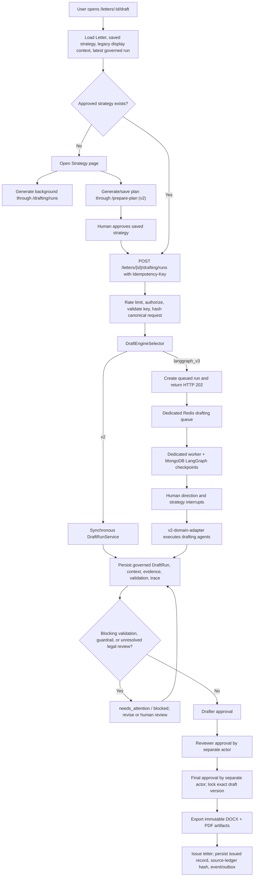
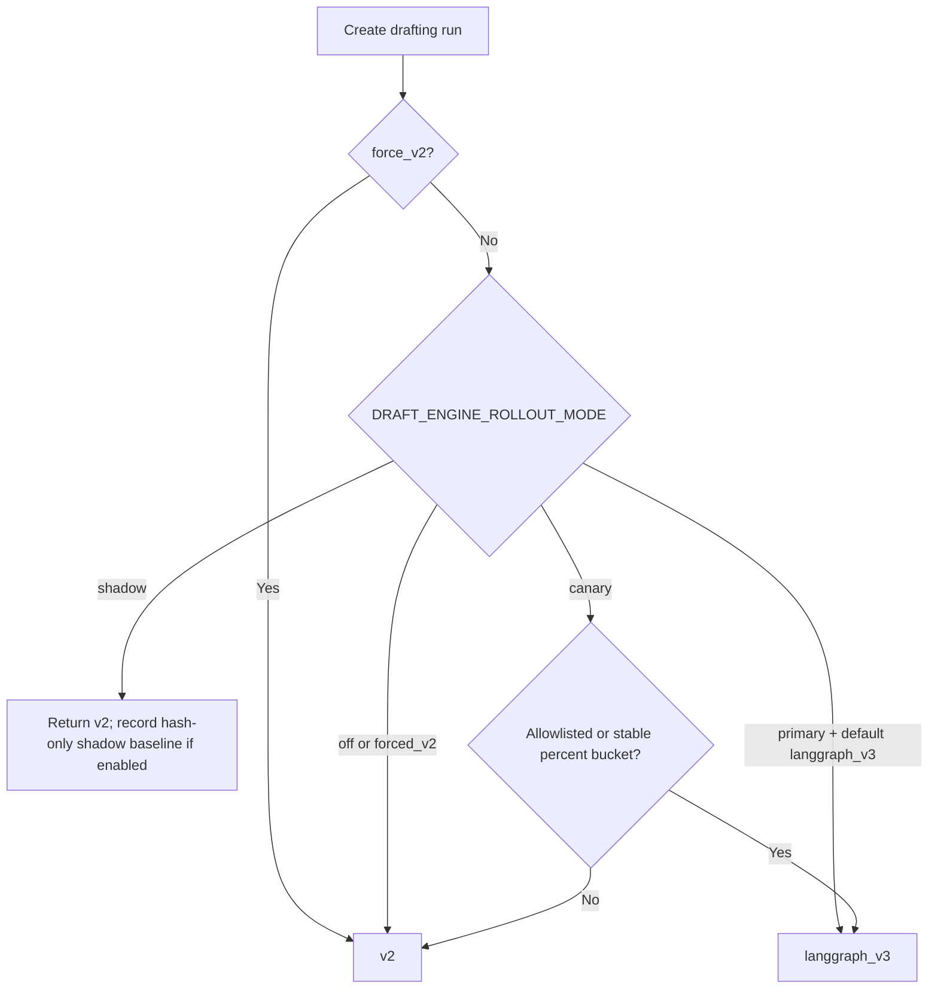
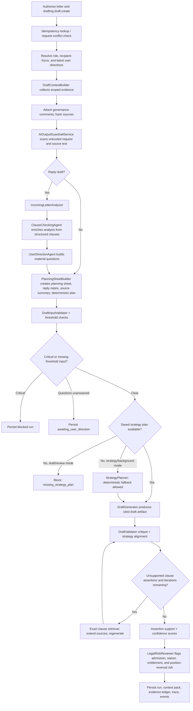
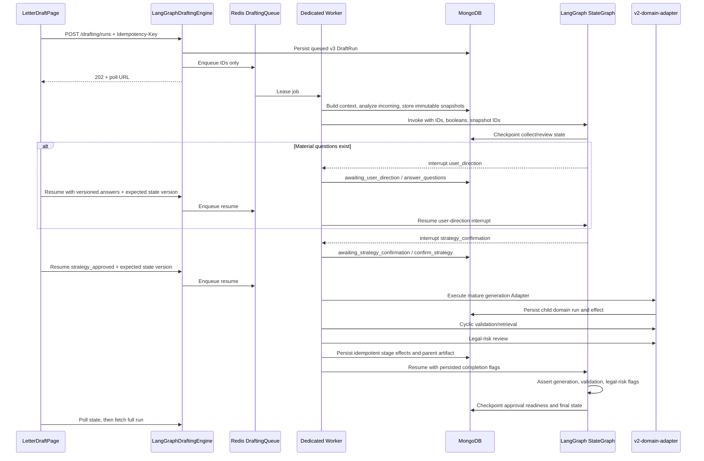
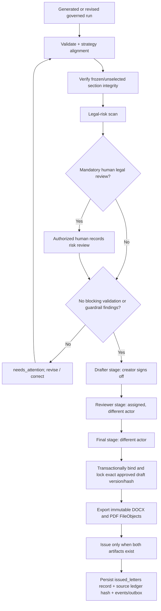

# Current Letter Drafting, Agent, and LangGraph Flow

**Recorded:** 2026-08-13  
**Scope:** Current `projectDMS` checkout, active client routes, registered backend routes, drafting Modules, persistence, and production Compose wiring.  
**Meaning of “current”:** This records the implementation presently in source. It does not claim that a particular production deployment has overridden the environment defaults unless that runtime was inspected separately.

## 1. Executive summary

The adopted letter-drafting Interface is `POST /api/letters/{letter_id}/drafting/runs`. The client sends the same request contract regardless of engine. The backend `DraftEngineSelector` chooses one of two Implementations:

- **v2:** synchronous `DraftRunService`; this is the configured source and Compose default.
- **langgraph_v3:** asynchronous `LangGraphDraftingEngine`; this uses the official LangGraph `StateGraph`, a dedicated Redis queue, MongoDB checkpoints, a conditional user-direction interrupt, a required strategy interrupt, and persisted idempotent effects. It deliberately reuses the mature v2 drafting Modules through a `v2-domain-adapter` rather than duplicating them.

The important architectural boundary is:

> LangGraph v3 owns orchestration, durable gates, checkpoints, queue execution, and state transitions. The v2 Modules still own evidence assembly, analysis, planning, draft generation, cyclic validation/retrieval, and legal-risk review.

The active `LetterDraftPage` may read older `/api/ai-assistant/langgraph/runs/{letter_id}` artifacts to display previously stored context. It does **not** use that legacy route to generate a new draft. New draft generation always enters the `/letters/{letter_id}/drafting/runs` Interface.

## 2. Module map and Interfaces

In the codebase-design vocabulary, the main Module is the governed letter-drafting workflow. Its public Interface is narrow; the complex Implementation stays behind the route and engine seam.

| Module / Interface | Present responsibility |
|---|---|
| `LetterDraftPage` + `useLetterDrafting` | Collect user inputs, require an approved strategy in the UI, create a run, poll v3, submit directions, confirm strategy, show evidence/risks, revise, approve, export, and issue. |
| `letter_drafting.router` | Authenticated HTTP Interface for run creation, state/resume/cancel/fallback, planning, analysis/direction, revision, validation, governance, approval, export, and issue. |
| `DraftEngineSelector` | Stable engine-selection Seam. Chooses v2 or `langgraph_v3` without changing the client request shape. |
| `DraftRunService` | Deep synchronous Module containing the mature domain Implementation. |
| `LangGraphDraftingEngine` | Durable asynchronous orchestration Adapter around the domain Implementation. |
| `DraftingQueue` | Dedicated Redis queue with leases, heartbeat, visibility recovery, retry, and dead-letter behavior. Only identifiers cross this boundary. |
| `DraftRunRepository` | MongoDB persistence for runs, events, snapshots, effects, governance records, outbox records, and accepted/approved versions. |
| `MongoDraftCheckpointStore` | Adapter from LangGraph checkpointing to MongoDB; checkpoint values are deliberately minimal and text-free. |

### Registered and active entry points

- Client route: `/letters/:id/draft` → `LetterDraftPage`.
- Main run creation: `POST /api/letters/{letter_id}/drafting/runs`.
- v3 state lifecycle: `GET .../state`, `POST .../resume`, `POST .../cancel`, `POST .../force-v2`.
- Planning: `POST .../prepare-plan`, `POST .../runs/{run_id}/confirm-plan`.
- Analysis and direction: `POST .../analyze-incoming`, `POST .../runs/{run_id}/confirm-analysis`, `POST .../runs/{run_id}/user-direction`.
- Revision controls: `POST .../lock-paragraphs`, `POST .../freeze-sections`, `POST .../revise`, `POST .../revise-sections`.
- Quality controls: `POST .../validate`, `POST .../critique`, `POST .../legal-risk`.
- Governance: reviewer assignment, comments, return for correction, plan/draft acceptance.
- Final lifecycle: staged approval, export, and issue.

The dedicated `prepare-plan` Interface calls `DraftRunService` directly, so strategic-plan generation currently remains on the mature v2 Implementation. The common `/runs` Interface is where server-side v2/v3 selection occurs.

## 3. Complete adopted flow

## 4. Frontend request and engine-selection flow

1. `LetterDraftPage` loads the letter and saved strategic-plan state. Draft generation is disabled until the strategy is saved and approved.
2. The page submits context-document IDs, linked/excluded letter codes, role, category, incoming-letter identifiers, purpose/action/event, instructions, and plan override through `useLetterDrafting.generateDraft()`.
3. The hook adds a fresh `Idempotency-Key` and calls the main `/drafting/runs` Interface.
4. A v2 response is a complete HTTP 200 `DraftRunResponse`.
5. A v3 response is an HTTP 202 `DraftRunAccepted`. The hook polls the small `/state` contract once per second, for up to 30 attempts, while `next_action == poll`, and then fetches the full run.
6. At `answer_questions`, the page sends question IDs, question versions, answers, directions, and `expected_state_version`.
7. At `confirm_strategy`, the page sends `strategy_approved: true` and the current `expected_state_version`.
8. The resulting governed run is displayed with its sources, validation findings, legal-risk report, frozen/locked controls, and approval chain.

### Engine policy

Current checked-in defaults are `DRAFT_ENGINE_DEFAULT=v2`, rollout `off`, canary `0`, drafting queue disabled, and drafting workers disabled. The root and backend `.env` files contain no overrides for those settings. A deployment may opt into v3 by supplying environment values; source defaults alone are not evidence that v3 is handling live traffic.

## 5. v2 synchronous domain flow

### v2 user-direction behavior

The v2 gate is durable but is not a suspended LangGraph thread. It stores the `awaiting_user_direction` run. The user-direction endpoint records answers/directions, and those directions are carried into the next strategy or draft run. The subsequent generation is therefore a new v2 run/version.

### Cyclic drafting loop

For AI draft/review modes, the default maximum is three iterations and is clamped to one through five. Each iteration critiques the artifact and checks strategy alignment. If a blocking finding identifies an unsupported clause query, the Implementation performs exact clause retrieval, extends the evidence set, regenerates, and validates again. It stops when findings clear, retrieval yields nothing useful, regeneration cannot continue, or the iteration limit is reached.

## 6. Agent and deterministic Module flow

“Agent” below means a code Module participating in the drafting pipeline; it does not imply an independently deployed process.

| Order | Module | Inputs | Output / gate |
|---:|---|---|---|
| 1 | `DraftContextBuilder` | Letter, scoped documents, conversation, selected/excluded references, user/project scope | Context bundle and source evidence: current materials, documents, clauses, registers, prior correspondence/positions, graph thread, and governance comments. |
| 2 | `AIOutputGuardrailService` | User inputs and retrieved source text | Deterministic prompt-injection findings. Critical verdict blocks drafting and approval. |
| 3 | `IncomingLetterAnalyzer` | Incoming reply letter/document | Issues, positions, requested actions, dates, and material matters requiring a response. |
| 4 | `ClauseCheckingAgent` | Incoming analysis plus structured clause records | Clause-enriched analysis and warnings; retrieval failure degrades with a warning rather than silently fabricating clauses. |
| 5 | `UserDirectionAgent` | Analysis, request, missing threshold inputs | Versioned material questions and formatted human directions. |
| 6 | `PlanningSheetBuilder` | Analysis, directions, context, evidence | Planning sheet, reply matrix, source summary, and deterministic plan text. |
| 7 | `DraftInputValidator` | Draft request and threshold inputs | Blocking/non-blocking input findings. |
| 8 | `StrategyPlanner` | Evidence-backed context and drafting goal | Strategy plan for strategy/background modes; deterministic fallback is recorded if the model path fails. |
| 9 | `DraftGenerator` | Approved/saved plan, sources, role, instructions | Draft artifact using the governed evidence and citation labels. |
| 10 | `DraftValidator` | Draft, sources, role, plan | Validation, critique, strategy-alignment findings, assertion support, and confidence inputs. |
| 11 | Exact-clause retrieval loop | Blocking unsupported clause query | Additional grounded sources followed by regeneration/revalidation. |
| 12 | `LegalRiskReviewer` | Draft and prior positions | Human-review flags for admissions, waiver, entitlement, and inconsistent stance. |
| 13 | `ScopedSectionEditor` | Only selected editable section text | Sanitized replacements; the server reconstructs the whole draft and verifies all unselected/frozen text exactly. |
| 14 | Human drafter, reviewer, final approver | Governed artifact and reports | Ordered, permissioned approval chain with separation of duties. |

The Modules have useful Depth: the route and client remain small while evidence rules, prompt construction, validation, provenance, revision integrity, and approvals stay local to the drafting Module. The engine Seam provides Leverage because rollout can change without duplicating the public request Interface.

## 7. Official LangGraph v3 flow

### Exact StateGraph

### What executes when

The diagram above is the official checkpointed `StateGraph`, but the synchronous node functions intentionally do not carry raw evidence or draft text. The worker performs the expensive/persistent operations around graph invocation:

### Graph state and checkpoints

`DraftGraphState` contains IDs, schema version, execution/next-action values, snapshot IDs, cancellation and stage-completion booleans, domain run ID/status, and approval readiness. It deliberately excludes raw source text, user directions, and draft content.

`MongoDraftCheckpointStore` writes to:

- `letter_draft_langgraph_checkpoints`
- `letter_draft_langgraph_checkpoint_writes`

Operations checkpoint inspection is restricted and redacts all non-basic values to a SHA-256 diagnostic shape. Full durable business state remains in `DraftRun` and its related collections.

### v3 human gates

1. **User-direction gate:** only interrupts when material questions exist. Resume requires the exact required question IDs, matching question versions, and the current optimistic `state_version`.
2. **Strategy gate:** always interrupts. The confirmed-strategy resume triggers domain generation, validation, and legal-risk work before LangGraph is resumed with completion flags.
3. **Approval gate:** this is a readiness calculation, not human approval. It exposes `next_action=approve` only when a draft exists, validation is non-blocking, and the guardrail verdict passes.
4. **Human approval chain:** executes after graph completion through the ordinary drafting governance Interfaces.

### v3 domain Adapter

The `v2-domain-adapter` creates a child v2 run with `stop_after_generation=True`, then copies its plan, context, sources, artifact, guardrail result, evidence ledger, and related data onto the v3 parent. The v3 worker then runs the cyclic validation and legal-risk stages and records an idempotent effect for each stage.

This is an intentional migration Seam, not a second independent agent system.

## 8. Queue, recovery, cancellation, and fallback

- v3 creation is rejected with service-unavailable if the dedicated drafting queue is not enabled.
- The queue is separate from contract ingestion and uses Redis queued/processing structures, leases, heartbeats, visibility-timeout recovery, bounded retry, and a dead-letter path.
- Only `run_id`, `letter_id`, job ID, and resume metadata cross the queue; full inputs/evidence are read from MongoDB.
- Workers are started only by the dedicated `rbac_backend.worker` process when `START_DRAFTING_QUEUE_WORKERS=true`; the web backend does not run them.
- Resume and worker state changes use `state_version` compare-and-set protection, preventing stale double submissions.
- Cancellation is cooperative. A queued/non-active run can become cancelled immediately; an active run records `cancel_requested` and the worker observes it at a safe boundary.
- Step-up-protected force-v2 fallback is permitted only before approval/export/issue or another completed external effect. It links the replacement run to the v3 source and records the fallback reason.
- Domain generation, validation, legal-risk review, export, and issue use effect keys so retries do not repeat completed side effects.

## 9. Persistence and provenance

The `DraftRunRepository` uses these MongoDB collections:

| Collection | Purpose |
|---|---|
| `letter_draft_runs` | Governed run state, engine metadata, artifacts, reports, revisions, approvals, and lifecycle fields. |
| `letter_draft_events` | Append-only lifecycle audit events. |
| `draft_context_packs` | Compressed evidence/context packs. |
| `letter_draft_assignments` | Reviewer assignment records. |
| `letter_draft_comments` | Governance comments. |
| `letter_draft_input_snapshots` | Immutable full input snapshot plus hash. |
| `letter_draft_evidence_snapshots` | Immutable text-free evidence identity/provenance rows plus context hash. |
| `letter_draft_effects` | Idempotent execution and external-effect ledger. |
| `letter_draft_outbox` | Durable downstream export/issue events. |
| `letter_draft_shadow_comparisons` | Hash-only shadow/canary comparison records. |

Each `DraftRun` can retain incoming analysis, questions/answers, planning sheet, reply matrix, context, sources, evidence ledger, plan, draft artifact, source-integrity summary, validation and legal-risk reports, cyclic trace, assertion support, confidence, revision ancestry, approvals, immutable export IDs, engine/thread/checkpoint metadata, snapshot hashes, state version, and lease/cancellation state.

The authoritative evidence remains outside LangGraph checkpoints. Checkpoints refer to immutable snapshots by ID; the evidence ledger preserves the drafting source labels and provenance used by the artifact.

## 10. Revision and exact-preservation flow

There are two revision paths:

### Whole-draft redraft with locked paragraphs

- Human-approved paragraphs are injected as `LOCKED` instructions.
- After generation, verification is exact modulo whitespace and case normalization.
- On violation, the Implementation retries once with a stronger instruction.
- Remaining violations are surfaced as warnings and are not silently repaired. The warning does not itself block the approval endpoint, so a reviewer must restore or otherwise reject the changed text.

This lock is therefore **wording-preserving modulo whitespace/case**, not byte-for-byte preservation.

### Scoped section revision with frozen/unselected preservation

- The draft is split into stable content sections while retaining separators.
- A caller supplies selected section indices and an optional expected draft hash.
- Frozen sections cannot be selected.
- Only selected section text is sent to `ScopedSectionEditor`; frozen and unselected content never enters the model-editable response path.
- Clause/date/currency/reference anchors cannot be removed or introduced by a scoped edit.
- The server reconstructs the draft deterministically from the source tokens.
- Every unselected/frozen section is compared by exact content and SHA-256 hash.
- Integrity failure rejects the revision or blocks validation/approval.
- A successful edit becomes a new v2 child run with source/result hashes and its approvals/export fields reset.

The scoped-section path has the stronger preservation guarantee and better Locality because the model receives only the text it is allowed to alter.

## 11. Validation, governance, approval, export, and issue

Approval order is strictly `drafter → reviewer → final`. Each stage has its own permission. The drafter must normally be the creator; reviewer and final actors must differ from earlier actors; an assigned reviewer is enforced. `drafting.admin` is the explicit override. Final approval is the stage that transactionally binds and locks the approved artifact version.

Export is idempotent and creates immutable DOCX and PDF artifacts. Issue is rejected until both exist. The issued record retains the run ID, artifact IDs, issued actor/time, and source-ledger hash.

## 12. Legacy `/ai-assistant/langgraph` compatibility path

The repository also registers:

- `POST /api/ai-assistant/langgraph/background`
- `POST /api/ai-assistant/langgraph/draft`
- `POST /api/ai-assistant/langgraph/strategy-plan`
- `GET /api/ai-assistant/langgraph/runs/{letter_id}`

Despite the route name, `LetterDraftGraph` in `ai_workflows/langgraph/letter_pipeline.py` is an imperative in-process pipeline, not the official checkpointed `StateGraph` used by `LangGraphDraftingEngine`. Its recorded stages are `load_state → collect_context → retrieve_sources → plan_response → draft_letter → review_draft → validate_and_route`.

Current UI behavior is transitional:

- `LetterDraftPage` reads the latest legacy graph run for display/backward-compatible context.
- `LetterStrategicPlanPage` and `LetterDraftPage` use the new governed drafting Interfaces for background, planning, and draft generation.
- `useLanggraphDraft` remains imported by `LetterDraftPage` only for its loading flag; the page does not call its legacy generate function.

Therefore, the legacy pipeline remains a callable compatibility Interface, but it is not the adopted engine-selection path for new drafting from the active letter pages.

The separate experimental `services/langgraph` sidecar is also not the official letter-drafting v3 runtime. The v3 source explicitly states that it does not redirect into that sidecar.

## 13. Present implementation boundaries and cautions

1. **Runtime activation is environment-dependent.** Source and Compose defaults select synchronous v2 and disable the drafting queue/workers. A runtime inspection is required to state which engine currently handles deployed traffic.
2. **LangGraph nodes are orchestration markers around persisted work.** Evidence retrieval happens before the first graph invocation; generation, cyclic validation, and legal-risk work happen in the worker before the final graph resume. The nodes assert persisted completion flags and checkpoint the sequence.
3. **v3 is a hybrid migration design.** It owns durable orchestration but still uses `DraftRunService` as its domain Adapter.
4. **Pre-gate analysis differs slightly.** v3 evidence collection runs `IncomingLetterAnalyzer` and `UserDirectionAgent` before the human gates. `ClauseCheckingAgent` and `PlanningSheetBuilder` are reached later through the v2 domain Adapter. Synchronous v2 performs clause enrichment before constructing its planning result.
5. **Planning has a direct v2 Interface.** `/prepare-plan` does not pass through `DraftEngineSelector`.
6. **Locked-paragraph verification is not byte-exact.** It normalizes whitespace and case and may leave a warning after one retry. Use scoped frozen-section editing for exact preservation.
7. **Approval readiness is not approval.** LangGraph ends with an `approve` next action; the three human stages still execute afterward.
8. **Legacy and official LangGraph names coexist.** They must not be treated as one runtime in operational analysis.

## 14. Primary source map

- Route registration: `backend/rbac_backend/main.py` lines 233–235 and 242.
- Governed drafting API: `backend/rbac_backend/routers/letter_drafting.py`.
- Active client route: `client/src/routes.tsx` around line 195.
- Active client workflow: `client/src/pages/LetterDraftPage.tsx` and `client/src/hooks/useLetterDrafting.ts`.
- Engine selection: `backend/rbac_backend/services/letter_drafting/engines/policy.py`.
- v2 domain Implementation: `backend/rbac_backend/services/letter_drafting/service.py`.
- Official StateGraph and worker: `backend/rbac_backend/services/letter_drafting/langgraph_engine.py`.
- Dedicated queue: `backend/rbac_backend/services/letter_drafting/drafting_queue.py` and `backend/rbac_backend/worker.py`.
- Persistence: `backend/rbac_backend/services/letter_drafting/repository.py`.
- Run contracts/state: `backend/rbac_backend/models/letter_drafting.py`.
- Context, agents, and quality Modules: `context.py`, `incoming_analyzer.py`, `clause_checker.py`, `user_direction.py`, `planning.py`, `generator.py`, `validator.py`, `input_validator.py`, and `legal_risk_reviewer.py` under `backend/rbac_backend/services/letter_drafting/`.
- Exact revision controls: `locked_text.py`, `frozen_sections.py`, and `section_editor.py` in the same package.
- Checked-in runtime defaults: `backend/rbac_backend/core/config.py` and `docker-compose.prod.yml`.
- Legacy compatibility pipeline: `backend/rbac_backend/ai_workflows/langgraph/letter_pipeline.py` and `backend/rbac_backend/routers/ai_assistant.py`.

## 15. Verification performed for this record

- Confirmed the client draft route and the actual hook called for draft generation.
- Confirmed backend router registration and the complete drafting route inventory.
- Traced engine selection from request through v2/v3 creation.
- Traced every official StateGraph node and edge, both interrupts, checkpoint store, worker execution, and v2-domain Adapter.
- Traced the current agent Modules, cyclic validation/retrieval loop, revision controls, approval separation, export, and issue paths.
- Confirmed MongoDB collection names and dedicated Redis queue recovery behavior.
- Compared source/config defaults with production Compose defaults and checked that the local `.env` files do not override the drafting-engine variables.
- Distinguished the legacy imperative `/ai-assistant/langgraph` pipeline from the official checkpointed drafting v3 runtime.
